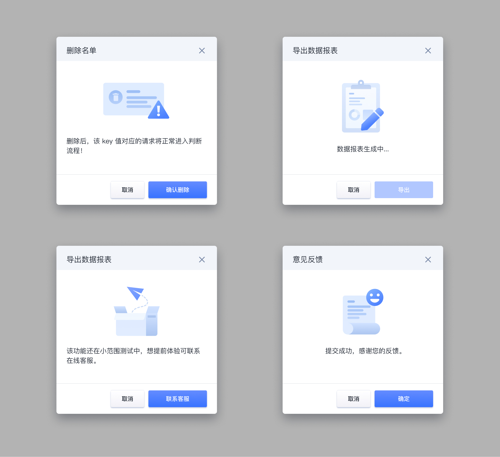
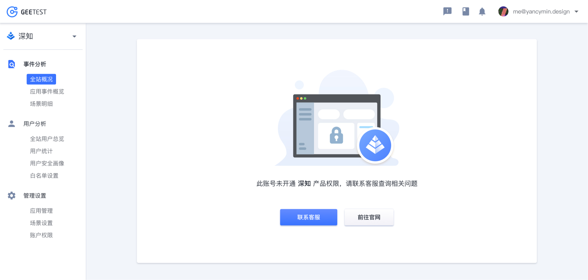

---

- 基础样式
- 使用规范

## 基础样式

G-UI 作为服务于 B 端的互联网安全平台，在基础插图设计上我们尽可能采用直观、简洁的风格，让用户专注于业务流程本身，在一定程度上丰富后台的界面设计。

基础插图外，在部分界面中我们采用面积更大、色彩更丰富的插图来渲染气氛，避免后台过于严肃。

## 使用规范

基础插图常用于弹出窗口中，配合提示文案作为信息的辅助展示，避免与文案含义不符合、表达内容模棱两可。

插图也可以在整个页面中展示，营造友好的氛围。

