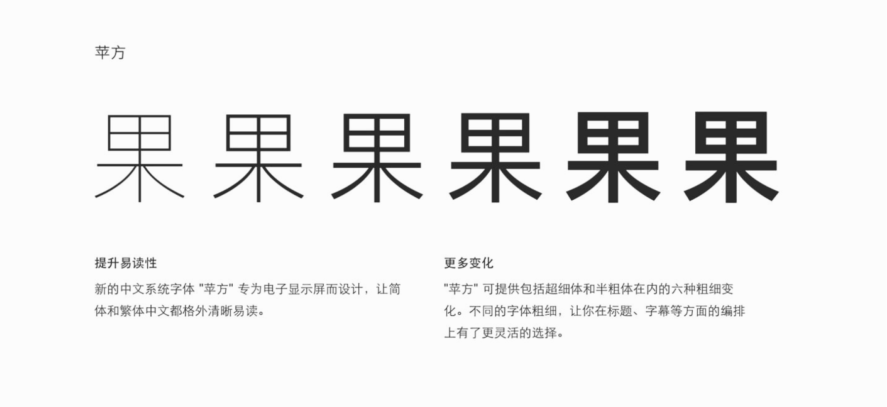
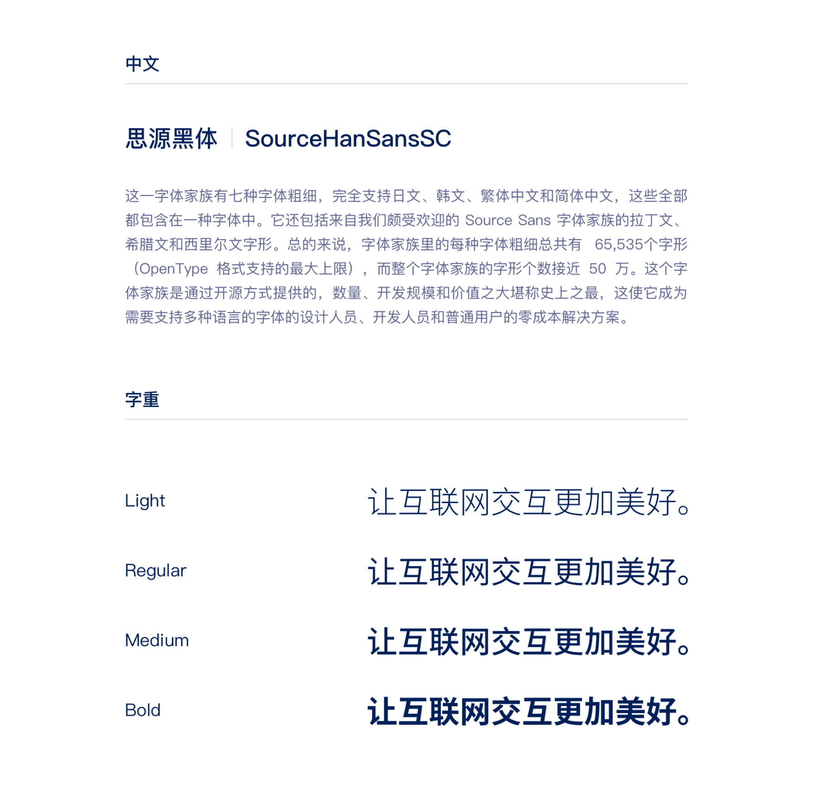
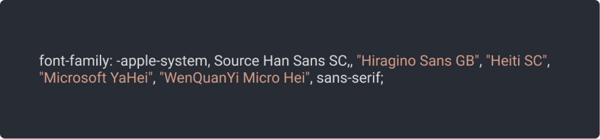
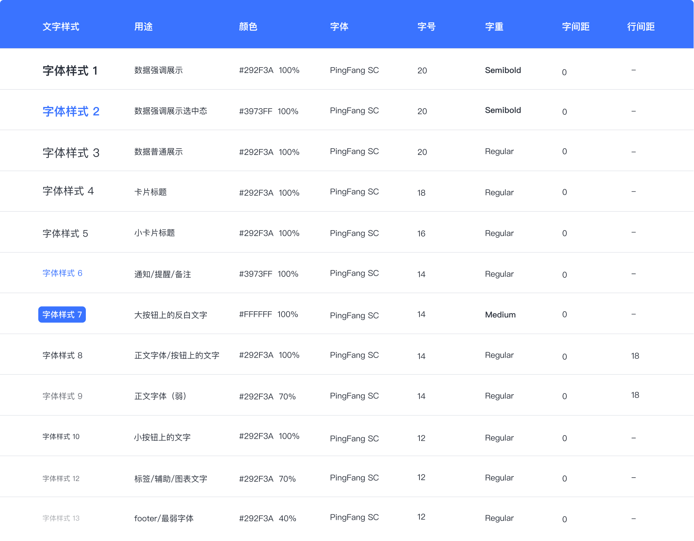
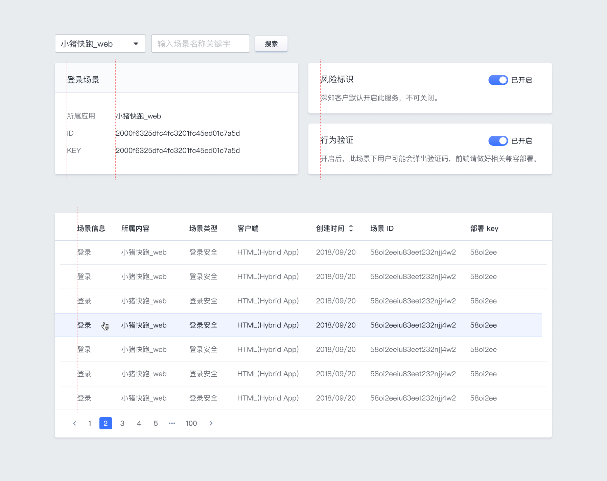

---

- 字体的选择
- 文字样式
- 文字排版

## 字体的选择

G-UI 在设计上我们选设备「苹方」字体。「苹方」是一款适合于界面应用的无衬线黑体，作为苹果操作系统上的专有字体，在其设备的显示屏上简体中文和繁体中文都格外清晰易读。「苹方」提供了包括 Ultralight、Thin、Light、Regular、Medium、Semibold 六种字重，在文字排版上有更灵活的选择。

针对非苹果系统的设备，我们建议使用免费可商用的「思源黑体」字体，同样是无衬线黑体并且有丰富的字重选择。由于「思源黑体」不是系统内置字体，在前端开发中可以使用在线字体以保证与设计稿的还原度。

除此之外，我们建议在前端开发中使用以下 font-family 的字体设置，以保证在不同系统、不同设备上都有良好的文字显示，避免因字体缺失而导致出现不合适的字体。

## 文字样式

G-UI 的设计中，我们用字号的大小、字重的粗细以及文字的颜色来进行不同内容的区分，使页面富有层次，让文字、段落易于阅读，提升整个后台的用户体验。我们用较大、较粗的文字作为标题，适中的文字用于正文，较小的文字用于辅助信息。

## 文字排版

G-UI 的设计中，我们绝大多数情况下采用文本定宽和居左对齐的排版模式。在中文字体下使用默认的字间距，行间距要比字号更大，段间距要比行间距更大，以保证阅读的舒适度。

