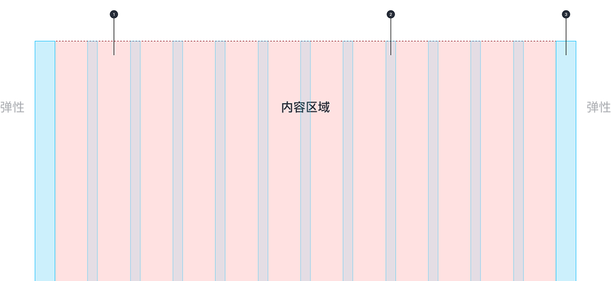
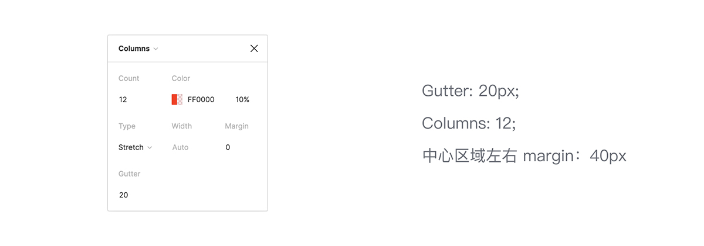
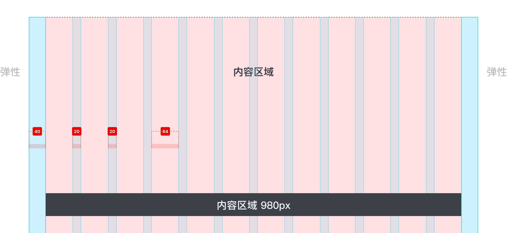
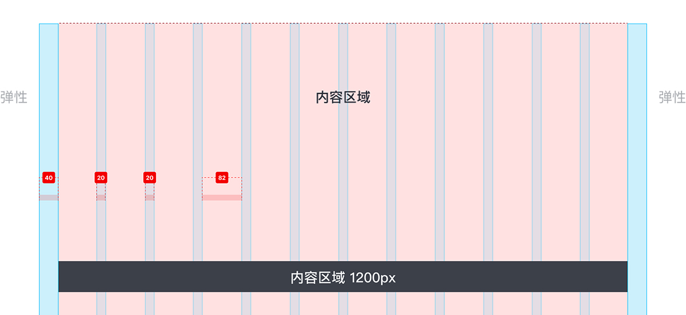
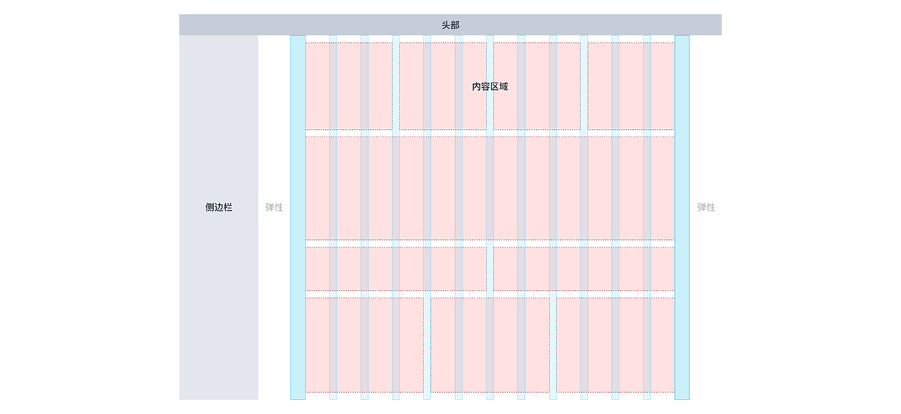

---

栅格系统是对界面元素进行横向排布时需要遵循的模式，不适用于类似图标与文字间隔的小型元素安排，而是用于大型区块间距的安排。

- 列，装订线和边距
- 栅格系统
- 中心内容区域尺寸（两个尺寸 1440/1920）
- 布局模式

## 列，装订线和边距

栅格化布局由列，装订线和边距组成，可适应屏幕尺寸和方向，从而确保跨布局的一致性。

1. 列
2. 装订线
3. 边距

## 栅格系统

基于实际分辨率数据，我们判断大多数用户都是在大于 1440px 宽度的屏幕中使用我们的界面，因此我们需要保证 1440 ～ 19200px 的屏幕范围内有一套统一的栅格来支撑一致的界面体验。以下是在屏幕宽度大于等于 1440px 时所使用的 12 栏栅格系统。

## 中心内容区域尺寸

1）下图基于 1440px 屏幕宽度演示：

2）下图基于 1920px 屏幕宽度演示：

## 布局模版

主要以单个卡片为动态容器为主，依据每行所需数量来安排，并响应视窗宽度变化。常见于数据图表、工作台等场景。

