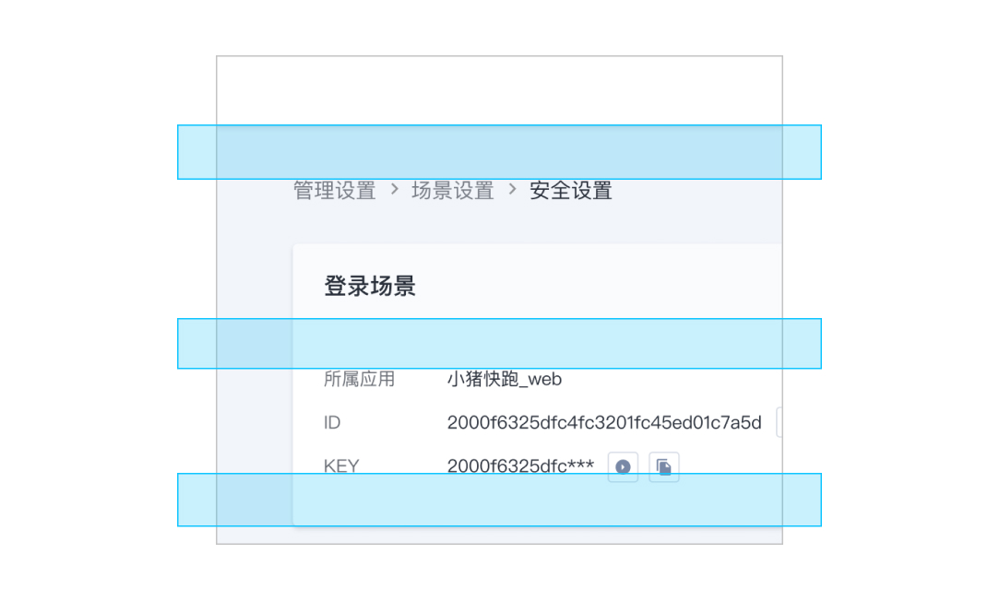

---

title: "间距"
date: "2020-02-14"
des: "为设计师设置界面元素中的间距与尺寸提供指导，减少设计决策成本，同时也利于开发人员理解其中的规则。"

---

该指南包含了容器间距、横向间距以及纵向间距，适用于元素、组件以及页面布局的设计。

- 设计原则
- 间距尺度
- 类型
- 间距规范的场景

## 设计原则

### 明确的关系

通过间距差异，准确表达信息与信息之间的关系：内容越相关，间距越小。

### 舒适的节奏

通过间距差异，准确体现信息间的主次关系，同时传递给用户既符合逻辑又舒适的信息读取节奏感。

## 间距尺度

组件和版式的所有间距均以 4 像素为增量，构成间距的基本度量单位。

## 颜色

| 间距（px） | 描述   | 实例                        |
| :--------- | :----- | :-------------------------- |
| 4          | 极紧   |  |
| 8          | 紧     |  |
| 16         | 基本   |  |
| 24         | 宽松   |  |
| 40         | 超宽松 |  |

## 类型

1. 容器间距 - 容器与内容间距。

2. 横向间距 - 多为行内间距，元素与元素；控件与控件之间的水平方向的间距。

3. 纵向间距 - 多为内容模块与模块之间的垂直方向的间距。

## 间距规范的场景

间距规范在特定场景下并不适用，此时不需要严格按照间距规则来设计，根据实际规则自动生成间距即可。

1. 栅格 - 优先考虑栅格规范，再考虑间距规范。
2. 居中 - 间距往往由容器实际大小决定，因此不受间距规范限制。
3. 自适应 - 可能会按比例缩放间距。
