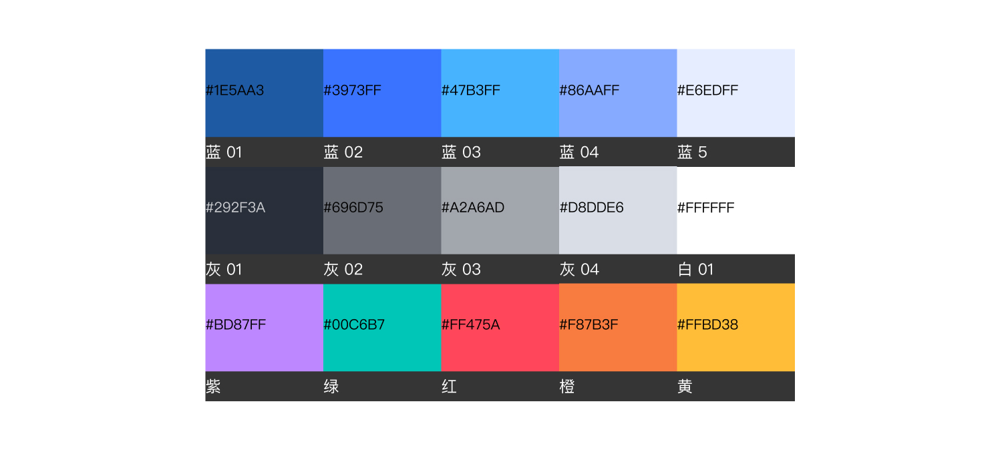

---

我们总共 48 种颜色用于整个应用程序，这些颜色在设计过程中提供了灵活性，同时也提供了一个和谐的调色板，看起来一致，符合我们的品牌风格。

## 通用型极验品牌色板

多用于物料与辅助设计设计。

## 颜色使用

### 大面积色块

| 色块                                                                                                     | 名称  | 用处   | 色值        |
| :------------------------------------------------------------------------------------------------------- | :---- | :----- | :---------- |
|  | 白    | 底色   | #FFFFFF     |
|                                       | 灰 13 | 底色   | #F2F5FA     |
|                            | 灰 06 | 遮盖色 | #000000 30% |

### 文字

| 色块                                                                                                     | 名称    | 用处                  | 色值    |
| :------------------------------------------------------------------------------------------------------- | :------ | :-------------------- | :------ |
|                                       | 灰 01   | 文字                  | #292F3A |
|                                       | 灰 02   | 文字                  | #696D75 |
|                                        | 灰 05   | 文字 - 残；底部版权色 | #A2A6AD |
|                                        | 灰 08   | 文字                  | #CBCDD1 |
|  | 白      | 文字                  | #FFFFFF |
|                                        | 蓝 02   | 文字                  | #3973FF |
|                                        | 蓝灰 03 | 文字 - 残             | #B0C7FF |
|                                        | 红 01   | 文字 - 警示           | #DD1A32 |

### 文本框底色

搭配描边

| 色块                                                                                                     | 名称  | 用处          | 色值    |
| :------------------------------------------------------------------------------------------------------- | :---- | :------------ | :------ |
|  | 白    | 文本框 - 默认 | #FFFFFF |
|                                       | 灰 13 | 文本框 - 点击 | #F2F5FA |
|                                         | 橙 08 | 文本框 - 错误 | #FFF0F1 |

### 描边、阴影

| 色块                                                                | 名称  | 用处 | 色值    |
| :------------------------------------------------------------------ | :---- | :--- | :------ |
|  | 灰 10 | 描边 | #D8DDE6 |
|  | 灰 07 | 描边 | #C0C4CC |
|  | 灰 04 | 描边 | #909399 |
|  | 蓝 02 | 描边 | #3973FF |
|  | 红 01 | 描边 | #DD1A32 |
|  | 虚线  | 描边 | #696D75 |
|  | 阴影  | 卡片 | #CCD0D9 |

### 绘图

| 色块                                                                | 名称    | 用处 | 色值    |
| :------------------------------------------------------------------ | :------ | :--- | :------ |
|  | 灰 01   | 绘图 | #292F3A |
|  | 灰 03   | 绘图 | #7B818D |
|  | 灰 09   | 绘图 | #D0D2D7 |
|  | 蓝 01   | 绘图 | #1E5AA3 |
|  | 蓝 02   | 绘图 | #3973FF |
|  | 蓝 04   | 绘图 | #47B3FF |
|  | 蓝灰 02 | 绘图 | #86AAFF |
|  | 蓝灰 04 | 绘图 | #C4D6FF |
|  | 橙 01   | 绘图 | #8F4824 |
|  | 橙 02   | 绘图 | #F87B3F |
|  | 橙 04   | 绘图 | #FFBD38 |
|  | 橙 05   | 绘图 | #FFBD93 |
|  | 橙 07   | 绘图 | #FFE5D7 |
|  | 紫 01   | 绘图 | #9C38FF |
|  | 紫 02   | 绘图 | #BD87FF |
|  | 红 02   | 绘图 | #FF475A |
|  | 绿 02   | 绘图 | #00C6B7 |

### 按钮

| 色块                                                                                                                              | 名称    | 用处        | 色值              |
| :-------------------------------------------------------------------------------------------------------------------------------- | :------ | :---------- | :---------------- |
|                            | 渐变 02 | 按钮 - 默认 | #648CFF - #3973FF |
|                            | 渐变 03 | 按钮 - 悬停 | #7394FF - #4E82FF |
|                            | 蓝 02   | 按钮 - 点击 | #3973FF           |
|                                                                | 渐变 01 | 按钮 - 激活 | #4D7BFF - #154DEB |
|  | 渐变 04 | 按钮 - 默认 | #FFFFFF - #F2F2F7 |
|                                                                | 灰 12   | 按钮 - 悬停 | #E5E9F0           |
|                                                                | 灰 10   | 按钮 - 激活 | #D8DDE6           |
|                                                                | 蓝灰 03 | 按钮 - 残   | #B0C7FF           |
|                                                                | 灰 11   | 按钮 - 残   | #DFE3EB           |

### 图标

| 色块                                                                | 名称    | 用处        | 色值    |
| :------------------------------------------------------------------ | :------ | :---------- | :------ |
|  | 蓝 02   | 图标 - 选中 | #3973FF |
|  | 蓝灰 01 | 图标 - 默认 | #7888A6 |

### 提示框底色

| 色块                                                                                                     | 名称    | 用处   | 色值    |
| :------------------------------------------------------------------------------------------------------- | :------ | :----- | :------ |
|                                       | 灰 01   | 提示框 | #292F3A |
|                                       | 蓝 03   | 提示框 | #338DF6 |
|                                       | 蓝灰 06 | 提示框 | #E6EDFF |
|                                       | 灰 13   | 提示框 | #F2F5FA |
|  | 白      | 提示框 | #FFFFFF |

### 提示色

提示程度从上至下依次增强

| 色块                                                                | 名称  | 用处    | 色值    |
| :------------------------------------------------------------------ | :---- | :------ | :------ |
|  | 蓝 02 | 程度 01 | #3973FF |
|  | 橙 03 | 程度 02 | #F6A114 |
|  | 橙 02 | 程度 03 | #F87B3F |

### 行业用色

| 色块                                                                | 名称    | 用处    | 色值    |
| :------------------------------------------------------------------ | :------ | :------ | :------ |
|  | 橙 06   | 底 - 褐 | #FADFE2 |
|  | 橙 01   | 字 - 褐 | #8F4824 |
|  | 绿 03   | 底 - 绿 | #DAF3DA |
|  | 绿 01   | 字 - 绿 | #448672 |
|  | 蓝灰 05 | 底 - 蓝 | #D8E4FF |
|  | 蓝 02   | 字 - 蓝 | #3973FF |
|  | 紫 03   | 底 - 紫 | #ECDCFF |
|  | 紫 01   | 字 - 紫 | #9C38FF |
|  | 橙 06   | 底 - 橙 | #FADFE2 |
|  | 橙 02   | 字 - 橙 | #F87B3F |
|  | 黄 02   | 底 - 黄 | #FFF4BD |
|  | 黄 01   | 字 - 黄 | #A68C04 |
