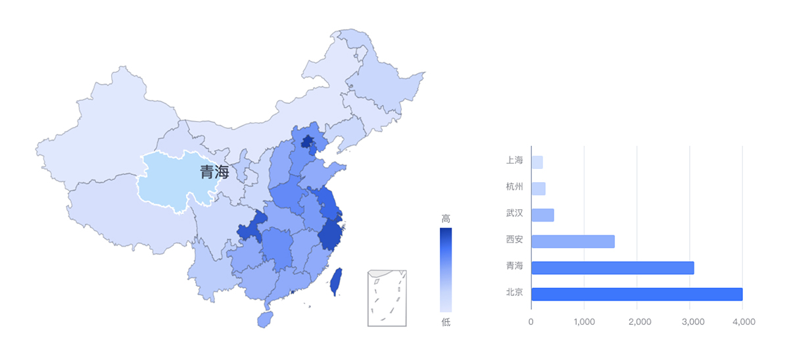
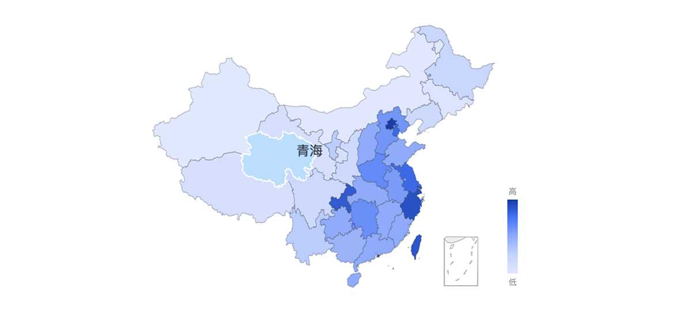
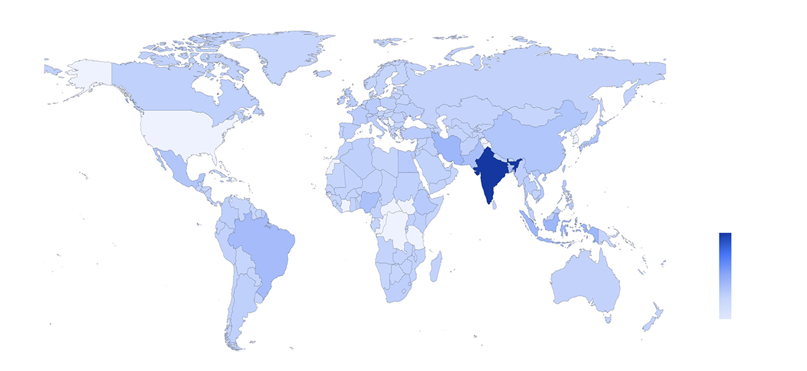
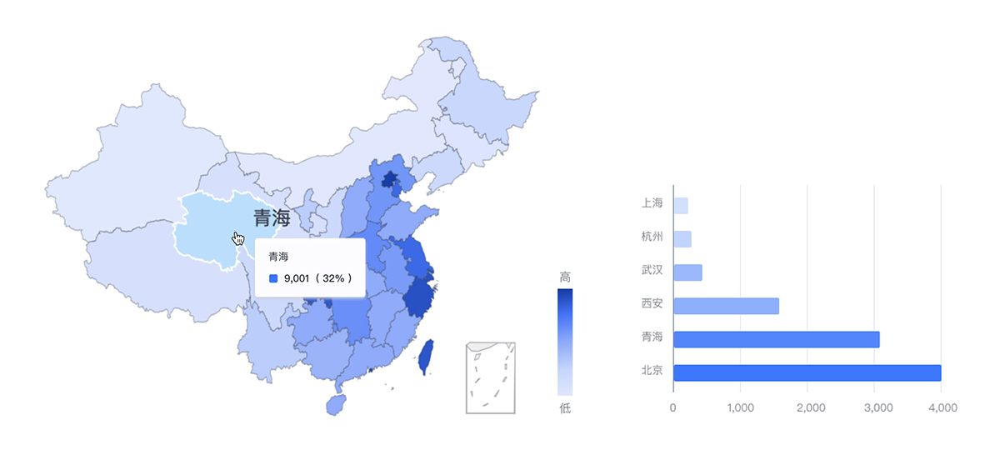

---

即分级统计图，贴图使用阴影，着色或符号在预定义区域内的位置上的差异来指示这些区域中某个属性或数量的平均值。

## 应用场景

分级统计图，是一种在地图分区上用符号（通常是一系列阴影）表示一个范围的值的分区的地图。

## 样式类型

### 全国 - 地图

在全国（预定义）区域的若干个小的区划单，根据各分区资料的数量指标进行分级。

### 全球 - 地图

在全球（预定义）区域的若干个小的区划单，根据各分区资料的数量指标进行分级。

## 交互形式

Tooltip：鼠标放置该区划单元内对象上显示详细数据。

