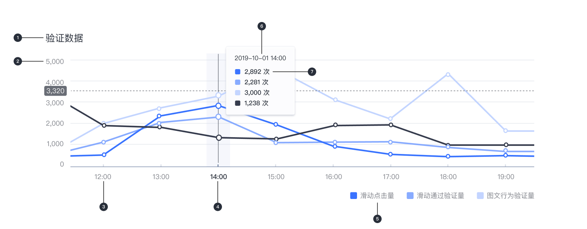
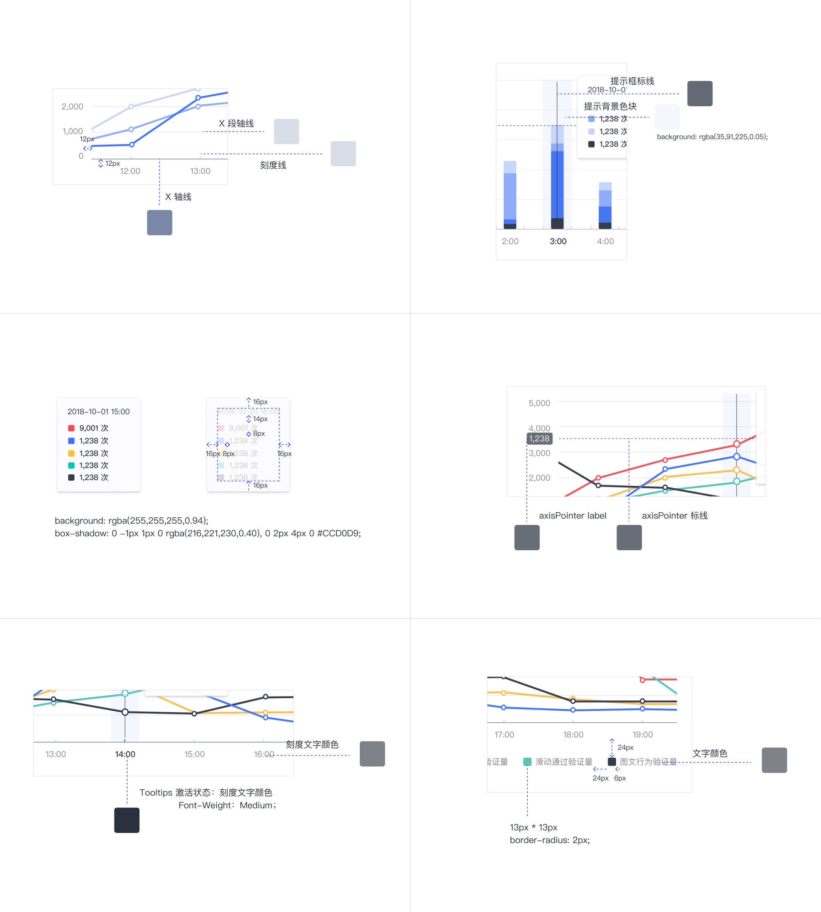

---

数据可视化过程始终始于一组数据，一个问题以及对数据的分析以找到答案，每个可视化都应专注于回答有关数据集的单个问题。

极验后台采用 ECharts 数据可视化框架。受益于 ECharts 开放的自定义项，在保持一致的样式和格式前提下，我们进行了各个产品的数据可视化需求的 UI 定制和图表类型的选用，确保以真实准确的方式呈现数据。

## 通用样式

数据可视化使用自定义样式和形状使数据一目了然，以下是不同类型的图表中的通用部分：

- 颜色
- 文字
- 坐标轴
- 坐标轴分割线
- 图例
- 提示框

## 色板

颜色可用于通过四种主要方式区分图表数据:

- 区分类别
- 代表数量
- 突出显示特定数据
- 表达意义

| 色块                                                                | 名称  | 色值    |
| :------------------------------------------------------------------ | :---- | :------ |
|  | 紫 01 | #c881ff |
|  | 紫 02 | #942dff |
|  | 橘 01 | #ff7216 |
|  | 橘 02 | #ffae76 |
|  | 橘 03 | #ffcfb8 |
|  | 橘 04 | #6c4230 |
|  | 黑 01 | #353c4f |
|  | 蓝 01 | #005aa9 |
|  | 蓝 02 | #00b4ff |
|  | 蓝 03 | #3973FF |
|  | 蓝 04 | #81aaff |
|  | 蓝 05 | #bfd5ff |

## 文字

文本可用于标记不同的图表元素，包括：

- 图表标题
- 数据标签
- 轴标签
- 图例

| 序号 | 实例                               | 字号（px） | 字重    |
| :--- | :--------------------------------- | :--------- | :------ |
| 1    | 图表标题｜ title                   | 18         | Regular |
| 2    | Y 坐标轴刻度标签｜ yAxis.axisLabel | 14         | Regular |
| 3    | X 坐标轴刻度标签｜ xAxis.axisLabel | 13         | Regular |
| 4    | X 坐标轴刻度标签 Hover             | 13         | Medium  |
| 5    | 图例文字｜ legend                  | 13         | Regular |
| 6    | 提示框文字 1 ｜ tooltip            | 12         | Regular |
| 7    | 提示框文字 2 ｜ tooltip            | 12         | Medium  |

## 图表通用元素

