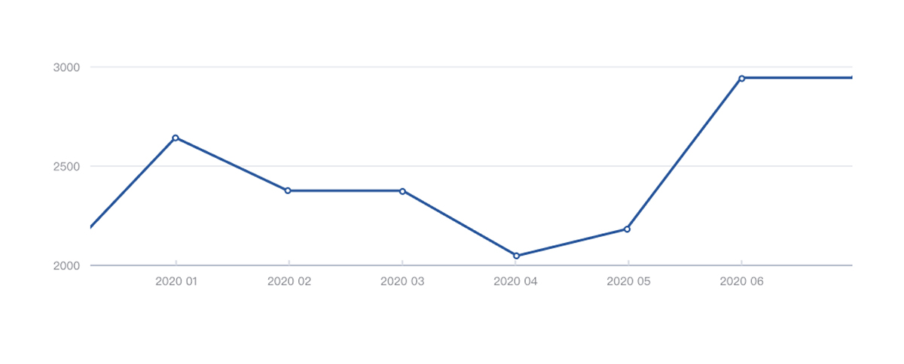
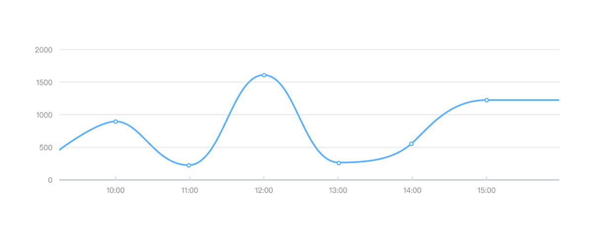

---

折线图是许多领域中常见的基本图表类型。它与散点图相似，不同之处在于测量点是有序的（通常是按其 x 轴值排序）并与直线段相连。折线图通常用于可视化时间间隔（时间序列）中的数据趋势，因此折线通常按时间顺序绘制。

## 什么时候应该使用折线图

当要强调一个变量（在垂直 Y 轴上绘制）的值变化而第二个变量（在水平 X 轴上绘制）的连续值时，将使用折线图。强调变化的方式是通过线段从左向右一致地移动并观察线的向上或向下的斜率。

## 常见滥用

### 严格使用零值基准

尽管条形图和直方图要求垂直轴的基线为零，但折线图不需要包含零基线。折线图的主要目标是强调值的变化，而不是值本身的大小。如果零线没有意义或没有用，可以将垂直轴范围缩放到可以使值的变化最有意义的范围。

### 无法识别点之间的不均匀间隙

当折线图缺少某些数据信息时，折线依然连接每个数据点，则记录中的数据缺少的间隙可以解释为想象值。这时需要显性的显示各个数据点，避免混淆图表的可解释性。

### 点之间的平滑曲线

在标准折线图中，每个点都通过直线段从头到尾连接到下一个点。线的方向和陡度被认为是值变化的指示，因此曲线可能暗示在实际测量之间有不存在的其他数据点，扭曲数据趋势的感知。切记为了追求审美上的诱惑，试图平滑地连接所有的点。

