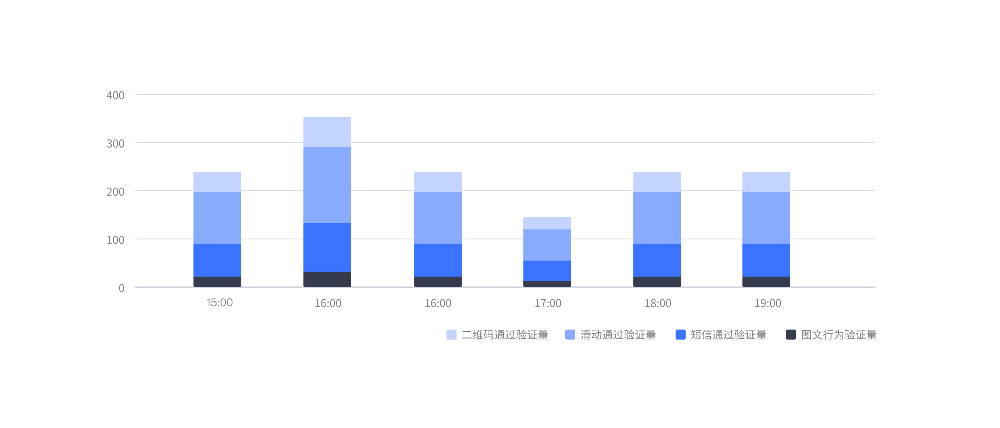
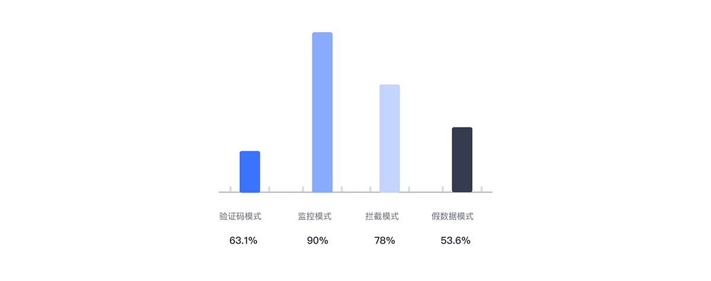

---

柱状图由一系列高度不等的纵向条纹表示数据分布的情况，用来比较两个或两个以上的价值（不同时间或者不同条件），只有一个变量，通常用于较小的数据集分析。

## 适用场景

适用于二维数据，一个维度数据进行比较、数据单纯性展示、排序数据展示。可以直观的看到各组数据差异性，强调个体之间的比较。不适合数据项数较多的场景，容易给人混乱的感觉。

## 柱状图子类型

### 基础柱状图

基础柱状图经常用来对比数值的大小，使用范围非常广泛，例如科比在不同赛季的得分、不同游戏 app 下载量、不同时期手机端综合搜索用户规模等。

需要注意的是，分类太多不适合使用竖向柱状图，此时，需要用到横向柱状图。

### 堆叠柱状图

与并排显示分类的分组柱状图不同，堆叠柱状图将每个柱子进行分割以显示相同类型下各个数据的大小情况。它可以形象地展示一个大分类包含的每个小分类的数据，以及各个小分类的占比，显示的是单个项目与整体之间的关系。我们将堆叠柱状图分为两种类型：

1）一般的堆叠柱状图：每一根柱子上的值分别代表不同的数据大小，各层的数据总和代表整根柱子的高度。非常适用于比较每个分组的数据总量。

2）百分比的堆叠柱状图：柱子的各个层代表的是该类别数据占该分组总体数据的百分比。

堆叠柱状图的一个缺点是当柱子上的堆叠太多时会导致数据很难区分对比，同时很难对比不同分类下相同维度的数据，因为它们不是按照同一基准线对齐的。
