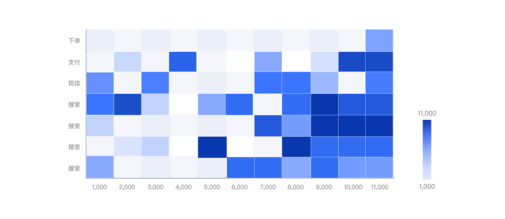
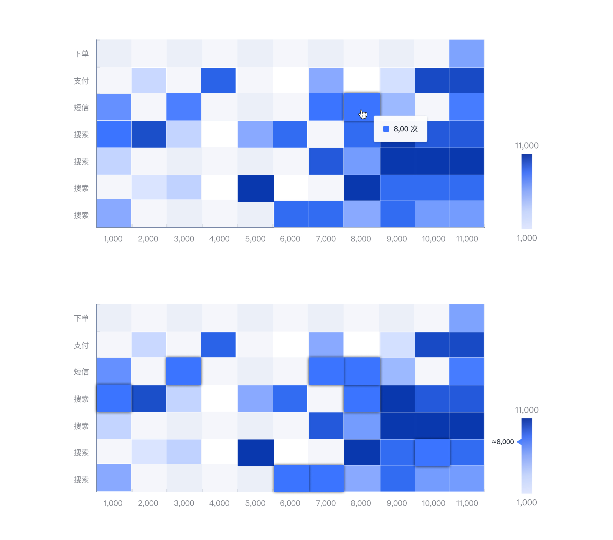

---

热力图是通过密度函数进行可视化的区分，可以用颜色的变化快速、直观的感知图表中不同数据在不同情况下的的密度。

## 应用场景

热力图经常用于地图上人员拥挤情况、网页鼠标轨迹图、基于时间维度的访问量等等。在 G-UI 设计中，我们将热力图用在表现不同场景的数据量上，通过颜色的深浅快速定位高数据或低数据的场景。

## 交互形式

Tooltip：鼠标放置该区划单元内对象上显示详细数据。

