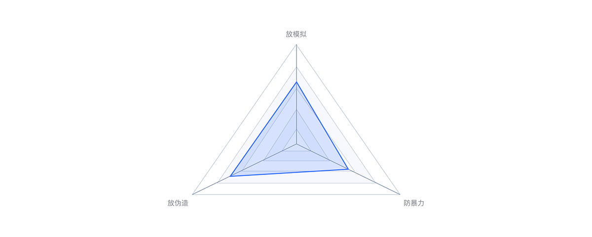
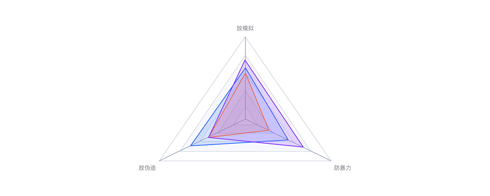
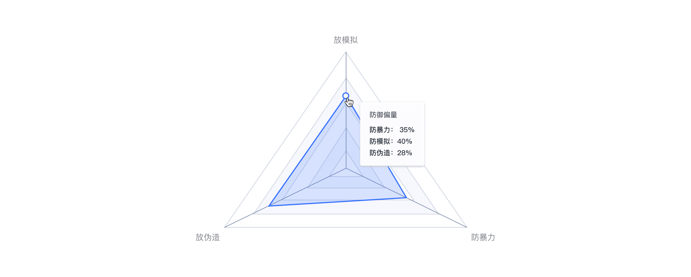

---

雷达图由三个或三个以上的定量变量从同一点开始在坐标轴上表示，适用于显示三个或更多的维度的变量。

## 应用场景

雷达图适合的数据：一个分类字段，一个连续字段，不超过 30 条数据为宜。

## 样式类型

### 单向 - 雷达图

可以在同一坐标系内展示多指标的分析比较情况，适用于对多属性体系结构描述的对象作出全局性、整体性评价。

### 多变量对比 - 雷达图

将三个不同对象的评估放到同一张雷达图上，通过色彩进行了对比。适用于多维数据（三维以上），且每个维度的数据是有序的。

## 交互形式

Tooltip：鼠标放置该区划单元内对象上显示详细数据。

