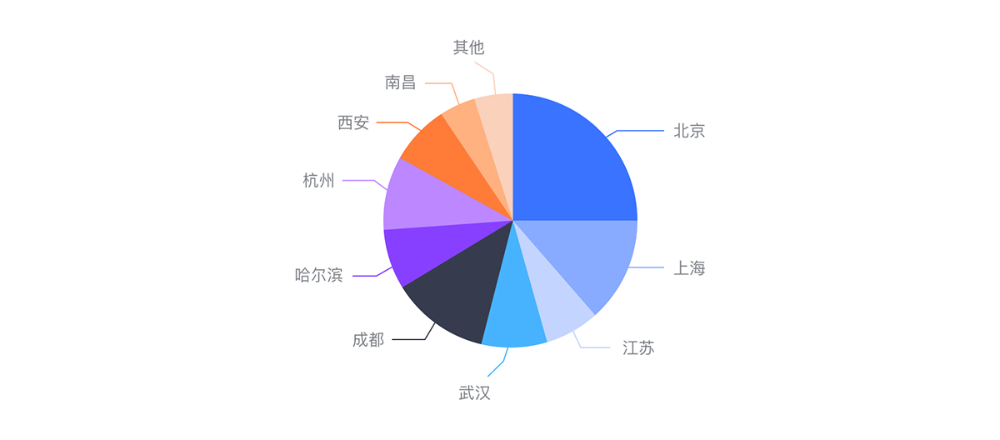
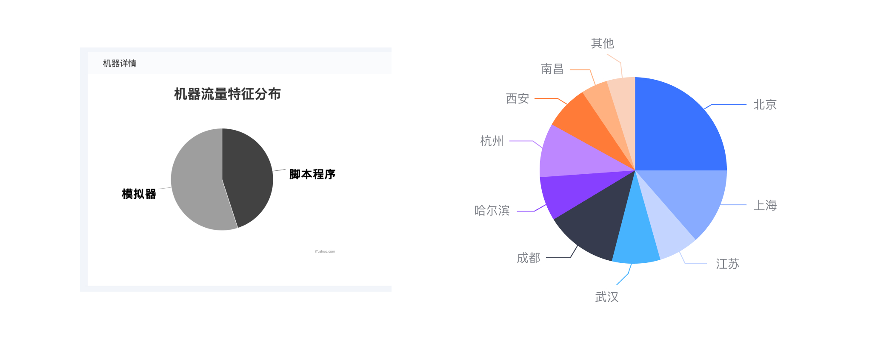
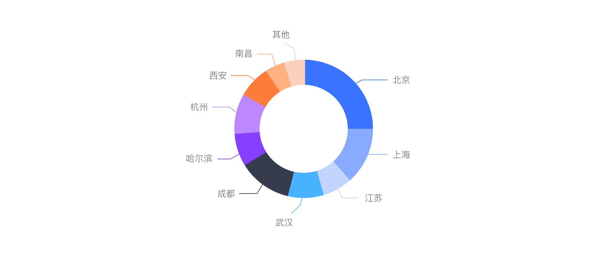
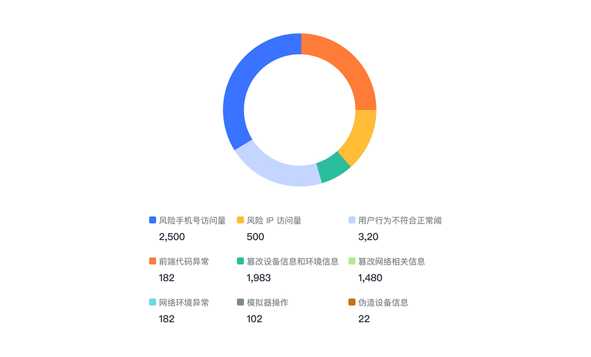

---

适用于一个维度各项指标占总体的占比情况，分布情况。能直观显示各项目和总体的占比、分布，强调整体和个体间的比较。适合比较简单的占比比例图，不要求精度的场景。

## 使用饼图的情况

1. 仅有一个要绘制的数据系列;
2. 仅要绘制的数值没有负值;
3. 仅要绘制的数值几乎没有零值;
4. 仅各类别分别代表整个饼图的一部分。

## 饼图子类型

### 常规饼图

通过将一个圆饼按照分类的占比划分为多个区域，整个圆饼代表数据的整体，每个扇形的大小表示各个分类占整体的百分比情况。

### 环形图

对比常规饼图，环形图中间被镂空了。总体是一个环形，各个分类的数据由环形的每一段表示。环形图可以让我们更关注长度，而不是面积。

### 数据呈现效果

Tooltip 显示：鼠标放在每个扇形区域上后显示的数据。

### 雷达条形图

虽然已不是饼图了，但也是由以一个个圆圈组成，最外一层的全表示的整体数值。

### 分离型饼图

分离型饼图显示每一数值相对于总数值的大小，同时强调每个数值。

