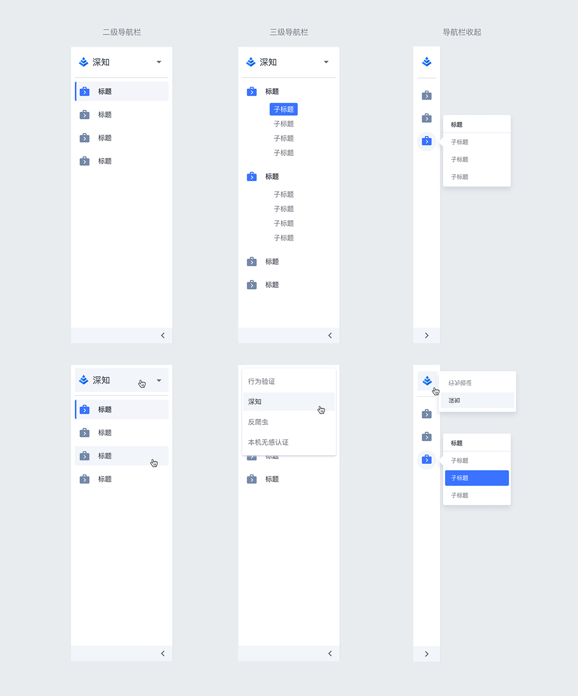
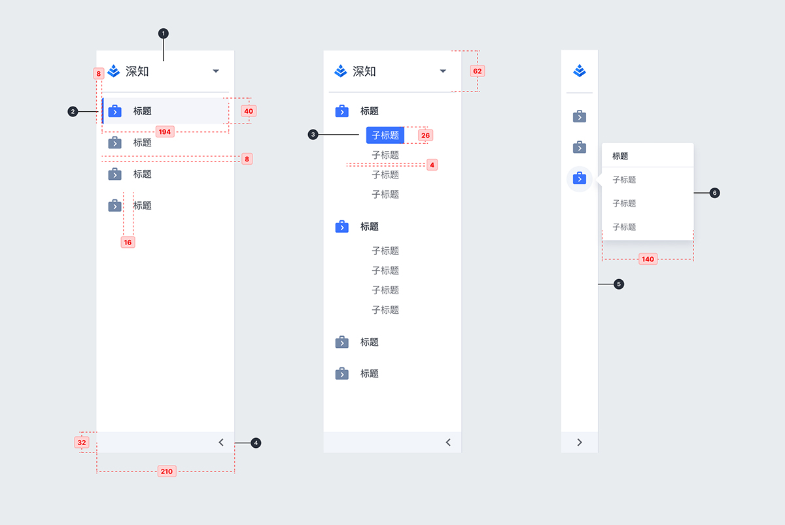

---

## 原则

### 合理规划

导航菜单不宜过多，不能隐藏超过，保证导航的高效。

### 快速定位

菜单需要明确的定位和表述去向。

### 层级

导航栏在视觉上需要与内容页区分，在不同场景下应保证内容页的展现。

## 状态

## 结构

1. 一级导航
2. 二级导航
3. 三级导航
4. 导航栏收起按钮
5. 导航栏收起
6. 导航栏收起状态-三级导航浮窗
7. 一级导航浮窗

## 风格样式

## 颜色

| 色块                                                                | 名称    | 用处               | 色值    |
| :------------------------------------------------------------------ | :------ | :----------------- | :------ |
|  | 灰 07   | 描边               | #C0C4CC |
|  | 蓝 02   | 激活状态指示       | #3973FF |
|  | 灰 01   | 标签文字、内容文本 | #292F3A |
|  | 灰 13   | 按钮悬停态         | #F2F5FA |
|  | 蓝灰 01 | 图标、图示         | #606B80 |

## 文字

| 实例         | 字号（px） | 字重    | 行间距（px） |
| :----------- | :--------- | :------ | :----------- |
| 一级导航     | 18         | Regular | -            |
| 二级导航     | 14         | Medium  | -            |
| 三级导航     | 14         | Regular | 13           |
| 三级导航浮窗 | 12         | Regular | -            |
