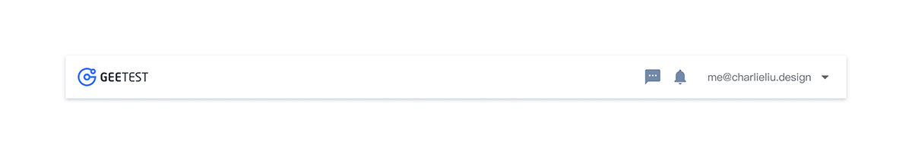
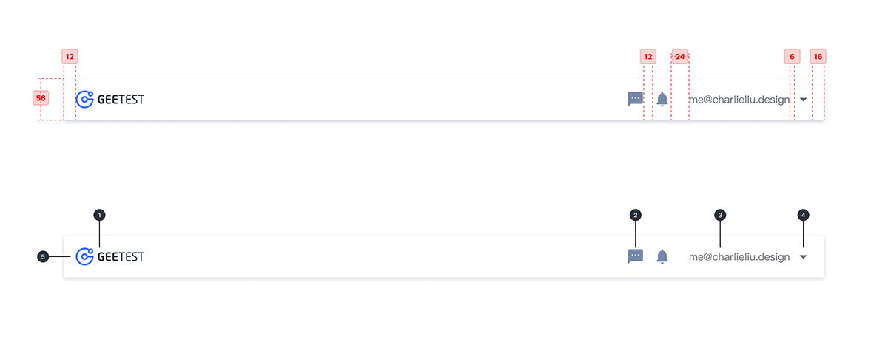
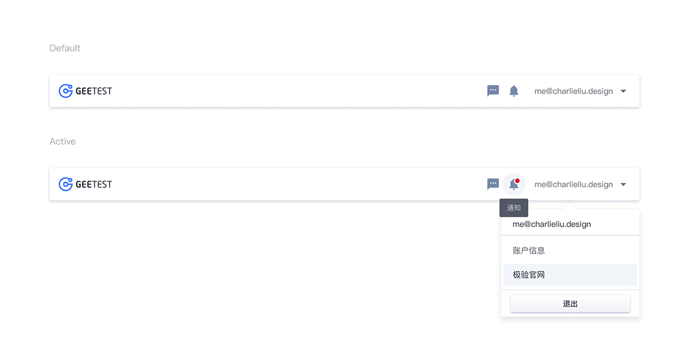

---

## 原则

### 全局

顶部导航提供全局性的类目和功能，同时具备品牌标识性。

## 种类

### 默认全局头部

左边标志具有返回首页的功能
右边设置有「消息」和「通知」以及「个人中心」
方便用户在全局的状态下查收和设置

## 结构

1. 标志
2. 图标（可选）
3. 个人信息
4. 下拉图标
5. 容器

## 状态

## 颜色

| 色块                                                                | 名称    | 用处     | 色值    |
| :------------------------------------------------------------------ | :------ | :------- | :------ |
|  | 蓝 02   | 标志颜色 | #3973FF |
|  | 灰 01   | 文字颜色 | #292F3A |
|  | 灰蓝 01 | 图标颜色 | #7888A6 |
|  | 灰 13   | 图标悬停 | #F2F5FA |

## 文字

| 实例     | 字号（px） | 字重    | 行间距（px） |
| :------- | :--------- | :------ | :---------- |
| 提示文字 | 14         | Regular | 14          |

## 阴影

| 实例 | 名称    | 参数        | 颜色    |
| :--- | :------ | :---------- | :------ |
| 容器 | 阴影 01 | 0px 2px 4px | #CCD0D9 |
