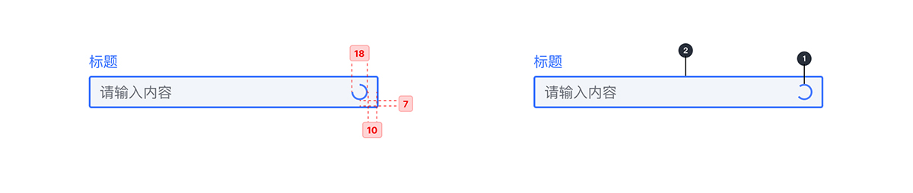
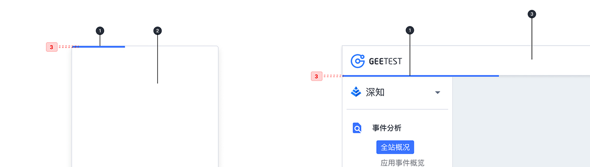

---

## 原则

### 操作反馈

响应用户的操作行为，指示进行的操作已提交至服务器并等待反馈。

### 可预期

在加载界面内容时，利用进度条让加载时间可预期。

## 种类

### 本地加载

用于加载本地资源，加载时间非常短。常用于本地页面内容的加载。

### 行内加载

当表单输入需要校验时，在表单尾部展示加载状态。

### 按钮控件加载

在用户点击按钮后，展示加载状态，指示进行的操作已提交至服务器。

### 全局加载

用于加载页面内完整内容，并展示加载过程中的进度，常用于弹窗内容的加载，或进入下一级界面的加载。

## 结构

### 本地加载

1. 加载指示

### 行内加载

1. 加载指示
2. 表单

### 按钮控件加载

1. 加载指示
2. 按钮控件

### 全局加载

1. 加载进度条
2. 弹窗
3. Head

## 颜色

| 色块                                                                                                      | 名称  | 用处 | 色值    |
| :-------------------------------------------------------------------------------------------------------- | :---- | :--- | :------ |
|                                        | 蓝 02 | 填充 | #3973FF |
|  | 白    | 填充 | #FFFFFF |
