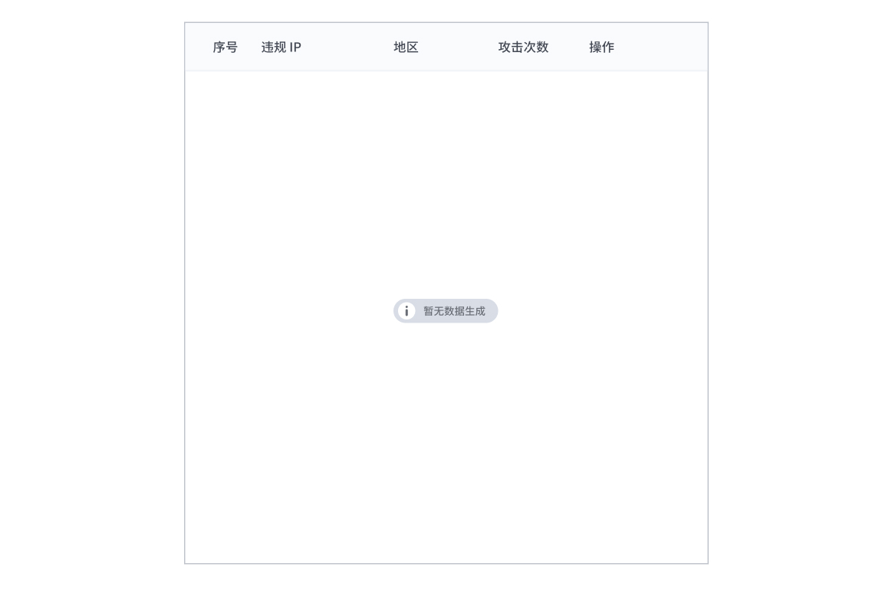
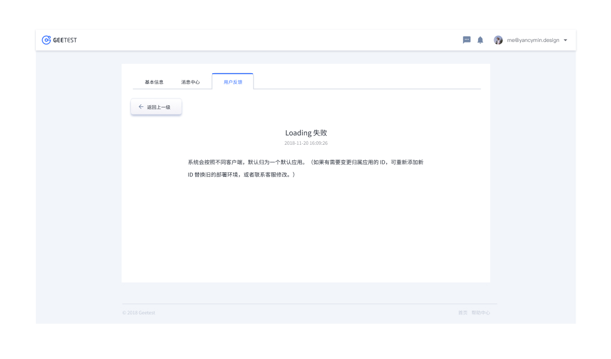

---

空状态是我们向没有内容可加载的用户进行通信的方式，以及他们接下来应该采取的操作。

## 原则

### 流畅

确保体验的流畅性，特别是当事情不像预期的那样工作时。

### 组成

空状态三元素：插图、描述和操作调用。

### 清晰

标题和信息应该清楚，简洁，并解释为什么用户看到这个屏幕。

## 种类

### 没有数据空状态

第一次使用，还没有数据。当数据被添加或可用时，用户了解页面上的可用内容。他们知道如何自己添加数据。

### 用户操作空状态

提供基于某些用户操作的反馈。例如：搜索时没有结果。

### 错误管理空状态

用易懂的话帮助用户理解问题，如果有可用的纠正措施，就知道要采取什么行动或有纠正问题的选项。

## 结构

1. 操作
2. 标题（若是图像则可选）
3. 文案

## 状态

## 颜色

| 色块                                                                                                     | 名称  | 用处   | 色值    |
| :------------------------------------------------------------------------------------------------------- | :---- | :----- | :------ |
|  | 白    | 背景色 | #FFFFFF |
|                                       | 灰 10 | 图标   | #D8DDE6 |
|                                       | 灰 01 | 文字   | #292F3A |
|                                       | 灰 02 | 文本   | #696D75 |

## 文字

| 实例     | 字号（px） | 字重    | 行间距 (px) |
| :------- | :--------- | :------ | :---------- |
| 标题文本 | 18         | Regular | 18          |
| 内容文本 | 14         | Regular | 14          |
| 按钮文本 | 12         | Regular | 12          |
