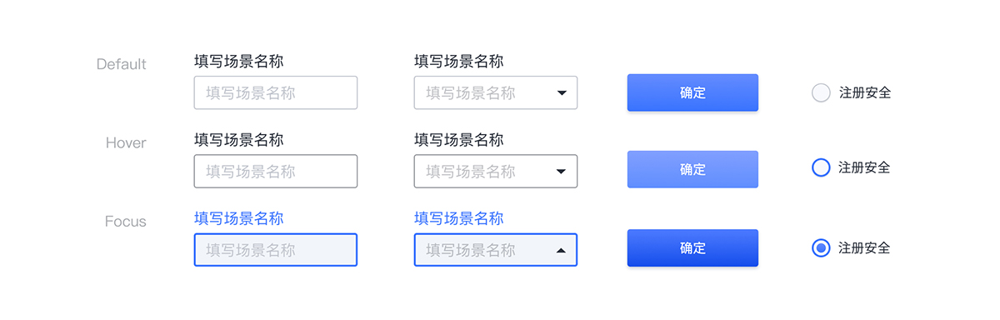

---

## 原则

### 占位符

提供要输入的内容的提示或示例(例如 YYYY-MM-DD)，方便用户理解与操作。

### 快速

整洁的排版，内容分清主次，保证表单的可读性。

### 间距

确保单个表单元素和输入组之间有足够的间隔。

## 种类

### 组件内的间隔

4px、8px 或 10px 用于组件内的左右间隔。
8px、16px 或 20px 用于组件内的上下间隔。

### 分离相关（或不相关）元素

30px 用于分离相关（或不相关）元素的间隔。

### 最后一个输入和按钮或按钮组

40px 用于最后一个输入和按钮或按钮组之间的间隔。

## 结构

1. 标签
2. 数据输入
3. 文本输入
4. 帮助
5. 选择控制
6. 按钮

## 状态

## 颜色

| 色块                                                                                                     | 名称    | 用处                 | 色值              |
| :------------------------------------------------------------------------------------------------------- | :------ | :------------------- | :---------------- |
|  | 白      | 特定状态下背景、按钮 | #FFFFFF           |
|                                       | 灰 13   | 特定状态下背景       | #F2F5FA           |
|                                       | 灰 08   | 特定状态下文字       | #CBCDD1           |
|                                       | 灰 07   | 描边                 | #C0C4CC           |
|                                       | 灰 01   | 文字                 | #292F3A           |
|   | 渐变 04 | 特定状态下按钮       | #FFFFFF - #F2F2F7 |
|   | 渐变 02 | 特定状态下按钮       | #648CFF - #3973FF |

## 文字

| 实例     | 字号（px） | 字重    | 行间距（px） |
| :------- | :--------- | :------ | :----------- |
| 标题文本 | 16         | Regular | 16           |
| 内容文本 | 14         | Regular | 14           |
| 按钮文本 | 14         | Regular | 14           |
