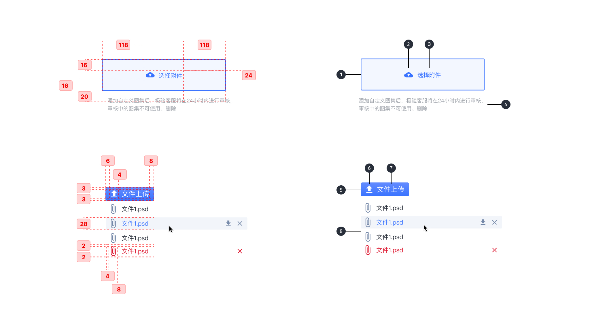
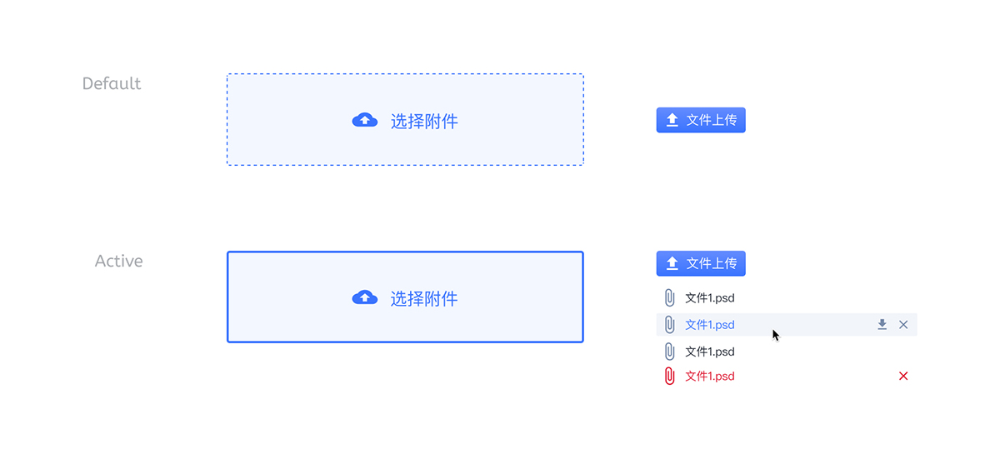

---

文件选择上传和拖拽上传控件。

## 原则

### 单张

每次仅可上传一张图片。

### 便捷

可点击按钮图片，也可以直接拖动图片上传。

### 快速

已上传的图片有可以直接操作（例：删除）的按钮。

## 种类

### 弹出窗口链接上传

点击上传按钮，选择需要上传的照片完成上传操作。仅支持单次操作上传单张图片。

### 拖动图片上传

可以直接拖动需要上传的单张图片至集装箱范围内完成图片上传。

## 结构

1. 集装箱
2. 附图 (可选)
3. 文案
4. 辅助信息（可选）
5. 集装箱
6. 附图 (可选)
7. 文案
8. 上传后效果

## 状态

## 颜色

| 色块                                                                                                     | 名称  | 用处                            | 色值    |
| :------------------------------------------------------------------------------------------------------- | :---- | :------------------------------ | :------ |
|  | 白    | 按钮上的字体、附图              | #FFFFFF |
|                                       | 灰 13 | 特定状态下集装箱颜色            | #F2F5FA |
|                                       | 灰 05 | 特定状态下文字                  | #A2A6AD |
|                                       | 蓝 02 | 特定状态下文字·集装箱颜色、附图 | #3973FF |

## 文字

| 实例     | 字号（px） | 字重    | 行间距 (px) |
| :------- | :--------- | :------ | :---------- |
| 内容文本 | 16         | Regular | 16          |
| 辅助信息 | 14         | Regular | 14          |
| 按钮文本 | 12         | Regular | 12          |
