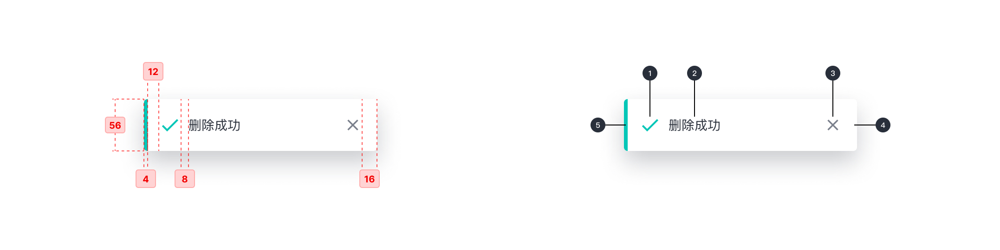

---

全局展示操作反馈信息。

## 原则

### 信息

可提供成功、警告和错误等反馈信息。

### 提示方式

顶部居中显示并自动消失，是一种不打断用户操作的轻量级提示方式。

## 种类

### 成功提示

信息提醒反馈，绿色代表成功信息；通过使用图标和颜色提示用户有效信息的类别。

### 信息提示

信息提醒反馈，灰色代表常规信息。

### 警告提示

信息提醒反馈，黄色代表警告信息。

### 错误提示

信息提醒反馈，红色代表错误信息。

## 结构

1. 提示图标（可选）
2. 文字
3. 取消图标
4. 容器
5. 颜色条（可选）

## 状态

