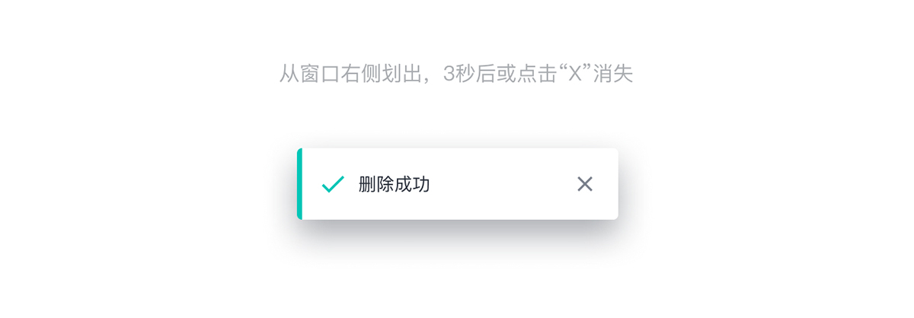

---

全局展示操作反馈信息。

## 原则

### 信息

可提供成功、警告和错误等反馈信息。

### 提示方式

顶部居中显示并自动消失，是一种不打断用户操作的轻量级提示方式。

## 种类

### 成功提示

信息提醒反馈，绿色代表成功信息；通过使用图标和颜色提示用户有效信息的类别。

### 信息提示

信息提醒反馈，灰色代表常规信息。

### 警告提示

信息提醒反馈，黄色代表警告信息。

### 错误提示

信息提醒反馈，红色代表错误信息。

## 结构

1. 提示图标（可选）
2. 文字
3. 取消图标
4. 容器
5. 颜色条（可选）

## 状态

## 颜色

| 色块                                                          | 名称  | 用处     | 色值    |
| :------------------------------------------------------------ | :---- | :------- | :------ |
|  | 灰 01 | 按钮文字 | #00C6B7 |
|  | 灰 01 | 按钮文字 | #7888A6 |
|  | 灰 01 | 按钮文字 | #FFBD38 |
|  | 灰 01 | 按钮文字 | #F87B3F |
|  | 灰 01 | 按钮文字 | #292F3A |
|  | 灰 01 | 按钮文字 | #7B818D |

## 文字

| 实例     | 字号（px） | 字重   | 行间距 (px) |
| :------- | :--------- | :----- | :---------- |
| 提示文字 | 14         | Medium | 14          |

## 阴影

| 实例 | 名称    | 参数          | 颜色        |
| :--- | :------ | :------------ | :---------- |
| 容器 | 阴影 03 | 0px 12px 29px | #292F3A/40% |
