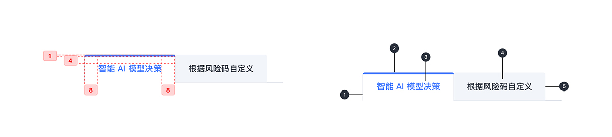

---

导航，用于组织并允许在相关的同一层次结构的内容组之间导航。

## 原则

### 信息丰富

选项卡将内容组织成类别，以帮助用户轻松找到不同类型的信息。

### 数量

标签数量一般 2 至 3 个。

### 用法

每个选项卡应该包含与集合中的其他选项卡不同的内容。

## 种类

### 数量 2

标签数量为 2 时，固定标签显示在一个屏幕上的所有标签，
每个标签在一个固定的宽度。可见选项卡集表示唯一可用
的选项卡。

### 数量 > 2

标签数量大于 2 时，页面数量与标签数量相同。页面固定在当前选择页，按钮呈被选择状态，按钮与页面随时保持一致。

## 结构

### 本地加载

1. 集装箱
2. 活动标签指示器
3. 活动文本标签(如果有图标，则为可选)
4. 非活动文本标签(如果有图标，则为可选)
5. 标签项

## 状态

