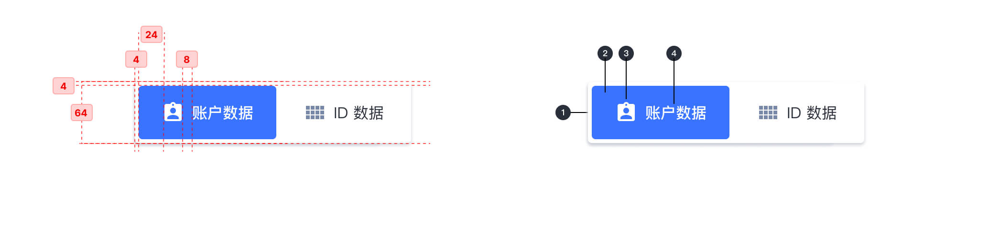
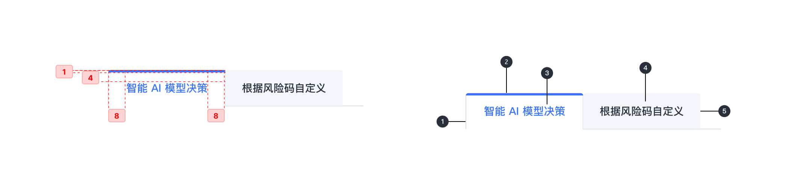

---

## 原则

### 层级

须根据页面内容结构分类，区别于二级标签页。

### 独立性

每个选项卡应该包含与集合中的其他选项卡不同的内容。

## 种类

### 一级标签页

用作父级标签页来直观地封装下方内容，下方内容可嵌套子标签页（二级标签页）。

### 二级标签页

最小标签页层级，下方内容不可再嵌套标签页。

## 结构

### 一级标签页

1. 底层容器
2. 激活指示面板
3. 图标 （可选）
4. 标签页标题

### 二级标签页

1. 集装箱
2. 活动标签指示器
3. 活动文本标签 (如果有图标，则为可选)
4. 非活动文本标签(如果有图标，则为可选)
5. 标签项

## 状态

## 颜色

| 色块                                                                | 名称  | 用处                   | 色值    |
| :------------------------------------------------------------------ | :---- | :--------------------- | :------ |
|          | 灰 07 | 描边                   | #D8DDE6 |
|  | 蓝 02 | 激活状态指示、内容文本 | #3973FF |
|  | 灰 01 | 标签文字、内容文本     | #292F3A |
|  | 灰 13 | 特定状态下的背景色     | #F2F5FA |

## 文字

| 实例     | 字号（px） | 字重    | 行间距（px） |
| :------- | :--------- | :------ | :----------- |
| 一级标签文本 | 16         | Regular | 16           |
| 二级标签文本 | 14         | Regular | 14           |
