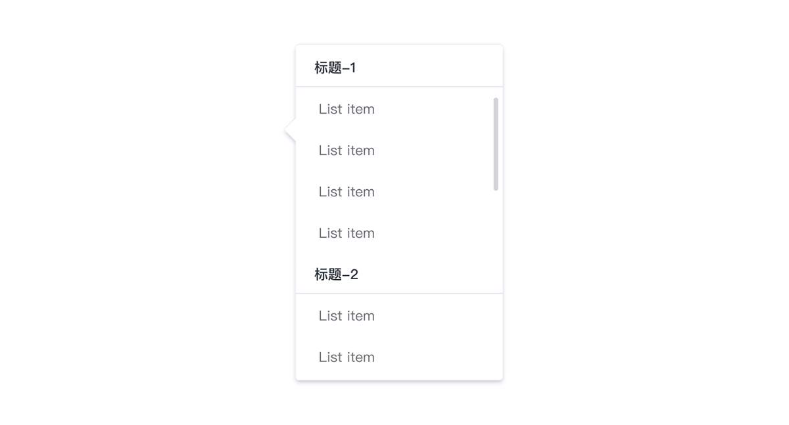
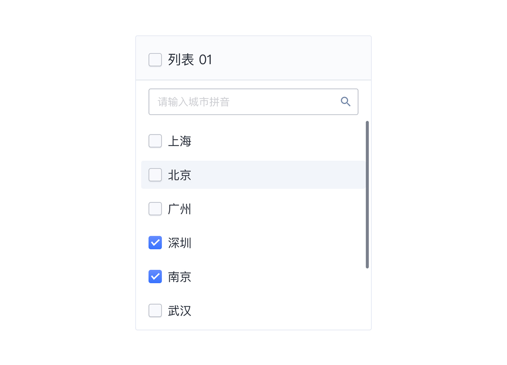
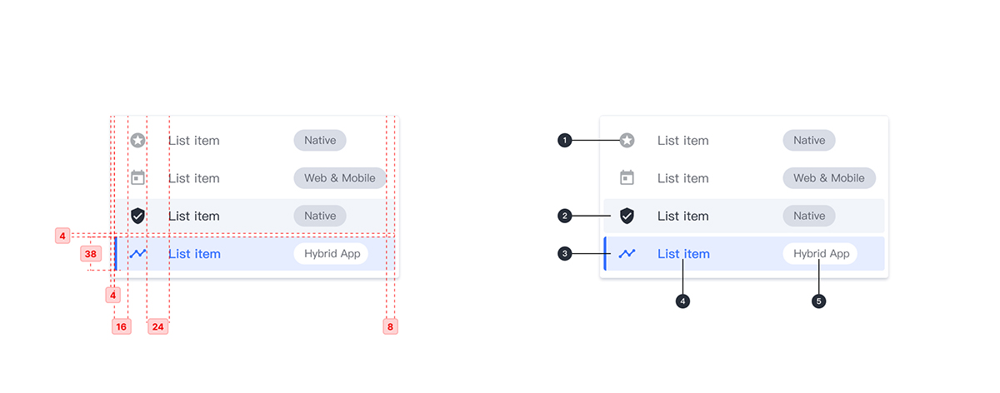

---

## 原则

### 逻辑

易于浏览的逻辑方式进行排序，例如字母，数字，时间顺序或根据用户的喜好。

### 一致性

应以一致的格式显示图标，文本和操作。

### 突出

在有选择操作属性的列表中，特定项目在视觉上更突出。

## 种类

### 基础列表

无交互的一组文本，仅展示信息。

### 选择列表

允许用户从列表项中进行单项选择，突出显示已选项。

### 分类选择列表

根据列表项的内容逻辑进行分类组合，使用副标题描述列表的各个部分。

### 带有辅助信息的选择列表

加入内容相关的前导图标和其他辅助元素（如：tags）有助于用户理解列表项的内容传达。

### 多选列表

此复选框既是列表项的主要动作又是状态指示符。

## 结构

1. 前导图标
2. Hover 状态
3. 已选项
4. 主要文字
5. 标签

## 状态

## 颜色

| 色块                                                                                                    | 名称    | 用处          | 色值              |
| :------------------------------------------------------------------------------------------------------ | :------ | :------------ | :---------------- |
|  | 渐变 02 | Checkbox      | #648CFF - #3973FF |
|                                      | 蓝 02   | 选中状态指示  | #3973FF           |
|                                      | 蓝灰 06 | Selected 状态 | #E5EDFF           |
|                                      | 灰 13   | Hover         | #F2F5FA           |
|                                      | 灰 01   | 选中文字      | #292F3A           |
|                                      | 灰 02   | 普通文字      | #696D75           |

## 文字

| 实例               | 字号（px） | 字重    | 行间距（px） |
| :----------------- | :--------- | :------ | :----------- |
| 分类选择列表选项   | 12         | Regular | 12           |
| 分类选择列表副标题 | 12         | Regular | 12           |
| 选项文字           | 14         | Regular | 14           |
| 多选列表选项文字   | 16         | Regular | 16           |
