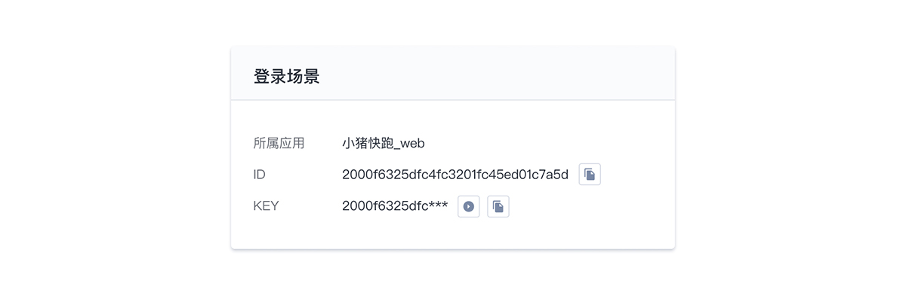
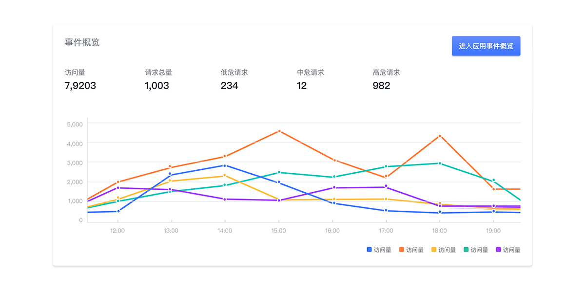
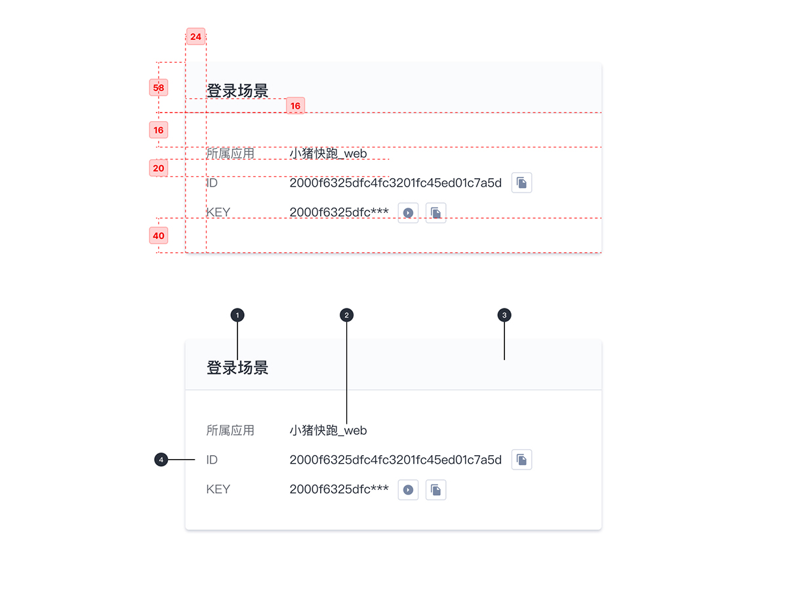

---

## 原则

### 通用

最基础的卡片容器，可承载文字、列表、图片、段落，常用于后台概览页面。

## 种类

### 典型卡片

包含标题、内容、操作区域。

### 图表卡片

支持更多内容配置，如图片、头像、标题和描述信息等。

## 结构

1. 标志
2. 信息文本
3. 标题容器
4. 卡片容器

## 状态

## 颜色

| 色块                                                                                                      | 名称  | 用处         | 色值    |
| :-------------------------------------------------------------------------------------------------------- | :---- | :----------- | :------ |
|  | 白    | 容器填充     | #FFFFFF |
|                                        | 灰 01 | 文字颜色     | #292F3A |
|                                        | 灰 13 | 标题容器底色 | #F2F5FA |

## 文字

| 实例     | 字号（px） | 字重   | 行间距（px） |
| :------- | :--------- | :----- | :----------- |
| 标题     | 18         | Medium | 18           |
| 信息文本 | 14         | Medium | 14           |

## 阴影

| 实例     | 名称    | 参数        | 颜色    |
| :------- | :------ | :---------- | :------ |
| 卡片容器 | 阴影 01 | 0px 2px 4px | #CCD0D9 |
