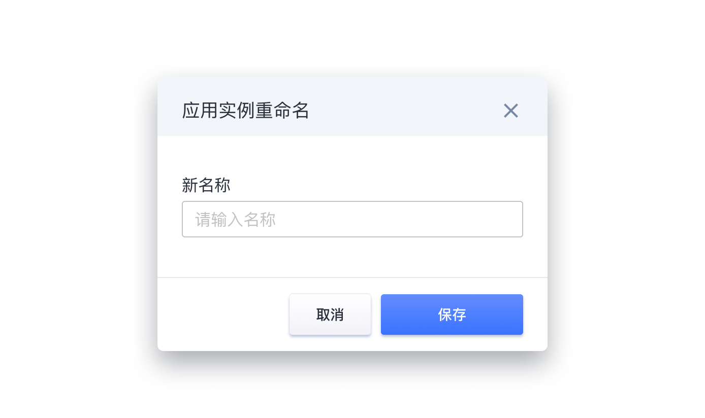
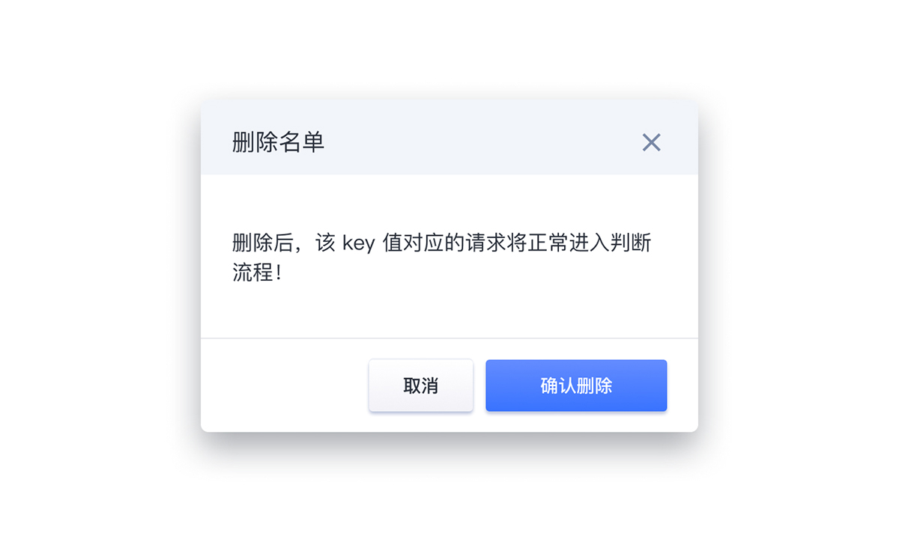
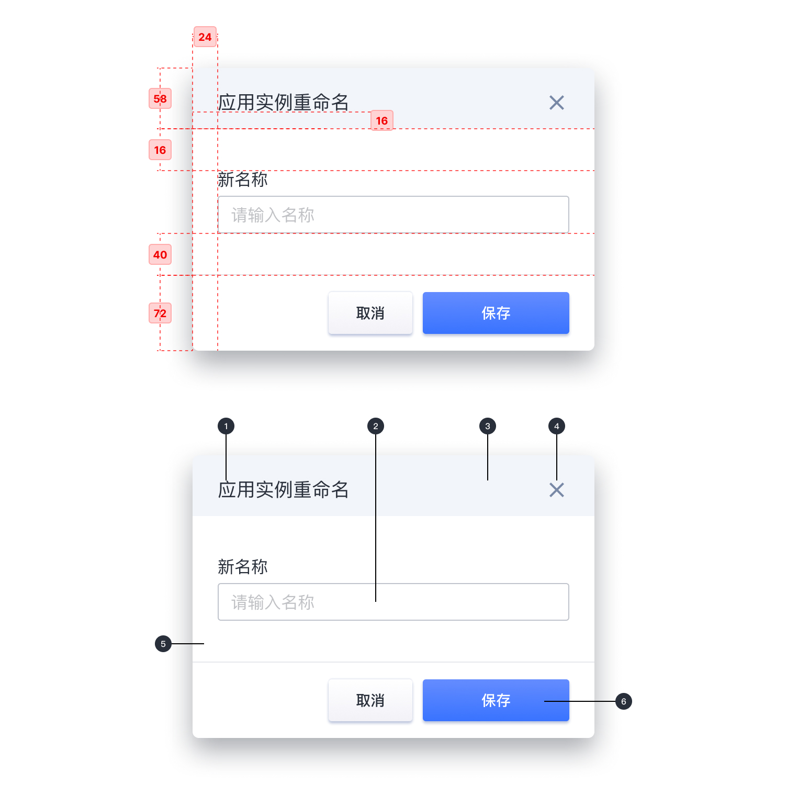
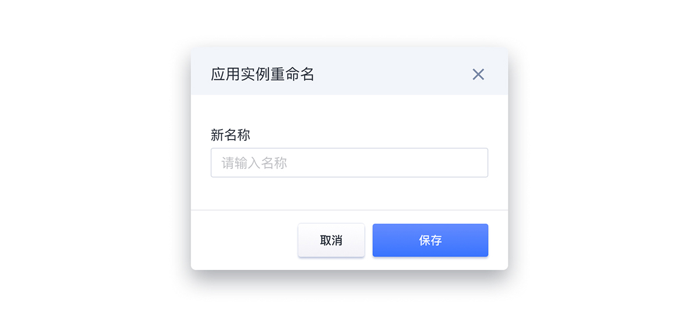

---

模态对话框。

## 原则

### 工作流程

不希望跳转页面以致打断工作流程时，可以使用 Modal 在当前页面正中打开一个浮层，承载相应的操作。

### 确认

另外当需要一个简洁的确认框询问用户时，可以使用。

## 种类

### 操作对话框

以浮层的方式，承载相应的操作。

### 确认对话框

以浮层的方式，提示用户的操作。

## 结构

1. 标志
2. 信息文本
3. 标题容器
4. 取消图标
5. 容器
6. 按钮

## 状态

