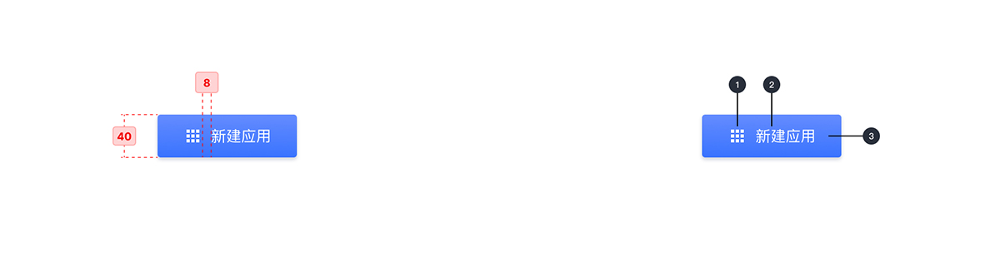
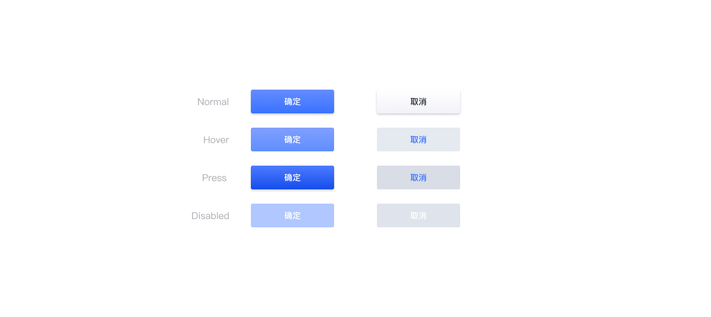

---

全局展示操作反馈信息。

## 原则

- 操作命令

响应用户点击行为，用户点击触发得到相应的业务逻辑和结果

- 状态

按钮 5 种状态分别是 Normal、Hover、Press、Disabled、Active，给予用户不同感知

## 种类

- 主要按钮

高度强调，与主操作相关，通过使用填充容器颜色引导用户视觉聚焦在按钮之上，视觉比较突出，强用户点击的按钮。

- 默认按钮

中等强调，常规操作，体积相对比较轻巧，具有按钮的功能性。

- 图标按钮

主要按钮的基础上，在文本旁边放置图标，以澄清操作并引起对按钮的注意。

- 文字链接按钮

文本链接按钮通常用于不太明显的操作，由于文本按钮没有容器，它们不会分散附近内容的注意力，视觉感受较弱。

## 结构

1. 图标（可选）
2. 文字
3. 容器

## 状态

