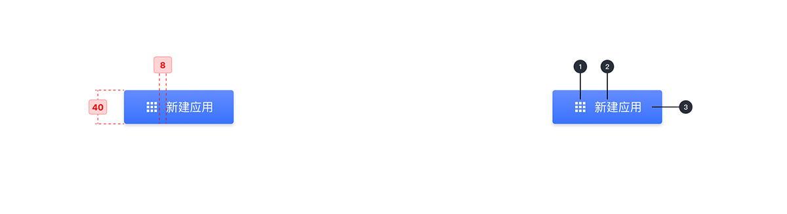
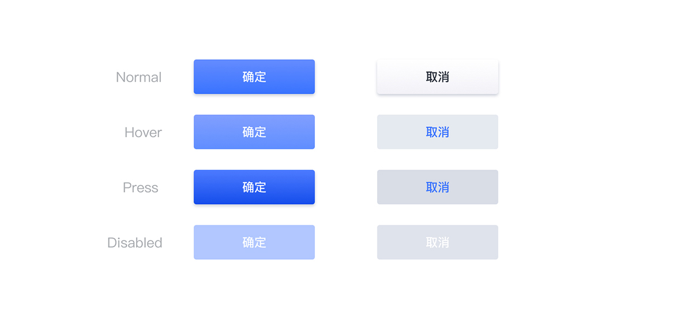

---

## 原则

### 操作命令

响应用户点击行为，用户点击触发得到相应的业务逻辑和结果。

### 状态

按钮 5 种状态分别是 Normal、Hover、Press、Disabled、Active，给予用户不同感知。

## 种类

### 主要按钮

高度强调，与主操作相关，通过使用填充容器颜色引导用户视觉聚焦在按钮之上，视觉比较突出，强用户点击的按钮。

### 默认按钮

中等强调，常规操作，体积相对比较轻巧，具有按钮的功能性。

### 图标按钮

主要按钮的基础上，在文本旁边放置图标，以澄清操作并引起对按钮的注意。

### 文字链接按钮

文本链接按钮通常用于不太明显的操作，由于文本按钮没有容器，它们不会分散附近内容的注意力，视觉感受较弱。

## 结构

1. 图标（可选）
2. 文字
3. 容器

## 状态

## 颜色

| 色块                                                                                                                                         | 名称    | 用处     | 色值              |
| :------------------------------------------------------------------------------------------------------------------------------------------- | :------ | :------- | :---------------- |
|                                       | 渐变 02 | 按钮默认 | #648CFF - #3973FF |
|                                       | 渐变 03 | 按钮悬停 | #7394FF - #4E82FF |
|                                       | 渐变 01 | 按钮激活 | #4D7BFF - #154DEB |
|                                                                                 | 灰蓝 03 | 按钮失效 | #B0C7FF           |
|  | 渐变 04 | 按钮默认 | #FFFFFF - #F2F2F7 |
|                                                                                 | 灰 12   | 按钮悬停 | #E5E9F0           |
|                                                                                 | 灰 10   | 按钮激活 | #D8DDE6           |
|                                                                                 | 灰 11   | 按钮失效 | #DFE3EB           |
|                                            | 白      | 按钮文字 | #FFFFFF           |
|                                                                                 | 蓝 02   | 按钮文字 | #3973FF           |
|                                                                                 | 灰 01   | 按钮文字 | #292F3A           |

## 文字

| 实例     | 字号（px） | 字重   | 行间距（px） |
| :------- | :--------- | :----- | :----------- |
| 按钮文字 | 14         | Medium | 14           |

## 阴影

| 实例 | 名称    | 参数        | 颜色    |
| :--- | :------ | :---------- | :------ |
| 容器 | 阴影 01 | 0px 2px 4px | #CCD0D9 |
