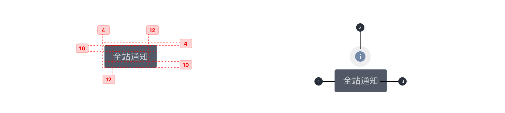

---

操作反馈，一种轻量级反馈/提示，可以用来显示不会打断用户操作的内容，适合用于数据交互的等场景中。

## 原则

### 持续

鼠标指针 hover 触发，不会自动消失。

### 简练

工具提示只包括简短的描述性文本。

### 匹配

一次只显示一个 Tooltips 。

## 种类

### Button 提示

使用工具提示进行交交互行为，出现在 Button 的右侧，由聊天框显示。

### icon 提示

当点击和持有屏幕元素或组件（在移动上）或悬停在其上（桌面）时，就会显示工具提示。显示提示同时 icon 会发生变化。

### 其他弱提示

使用工具提示进行交互行为，不会自动消失。

## 结构

1. 集装箱
2. icon 或 Button 等需要提示元素
3. 文本字符串

## 状态

