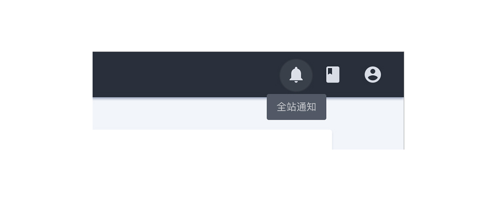

---

操作反馈，一种轻量级反馈/提示，可以用来显示不会打断用户操作的内容，适合用于数据交互的等场景中。

## 原则

### 持续

鼠标指针 hover 触发，不会自动消失。

### 简练

工具提示只包括简短的描述性文本。

### 匹配

一次只显示一个 Tooltips 。

## 种类

### Button 提示

使用工具提示进行交交互行为，出现在 Button 的右侧，由聊天框显示。

### icon 提示

当点击和持有屏幕元素或组件（在移动上）或悬停在其上（桌面）时，就会显示工具提示。显示提示同时 icon 会发生变化。

### 其他弱提示

使用工具提示进行交互行为，不会自动消失。

## 结构

1. 集装箱
2. icon 或 Button 等需要提示元素
3. 文本字符串

## 状态

## 颜色

| 色块                                                                                              | 名称  | 用处               | 色值    |
| :------------------------------------------------------------------------------------------------ | :---- | :----------------- | :------ |
|  | 白    | 特定状态下的文字   | #FFFFFF |
|                                | 灰 08 | 特定状态下的文字   | #CBCDD1 |
|                                | 灰 01 | 特定状态下的背景色 | #292F3A |
|                                | 灰 02 | 特定状态下的背景色 | #696D75 |

## 文字

| 实例     | 字号（px） | 字重    | 行间距 (px) |
| :------- | :--------- | :------ | :---------- |
| 内容文本 | 12         | Regular | 12          |
