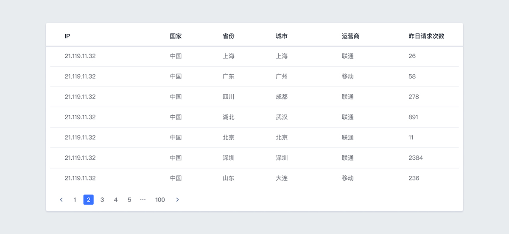
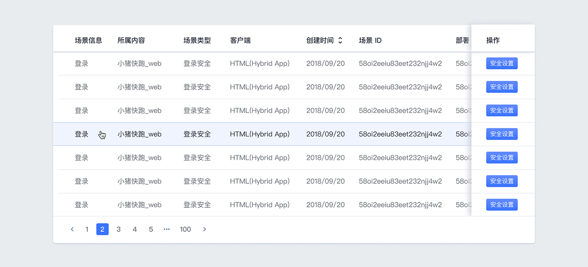
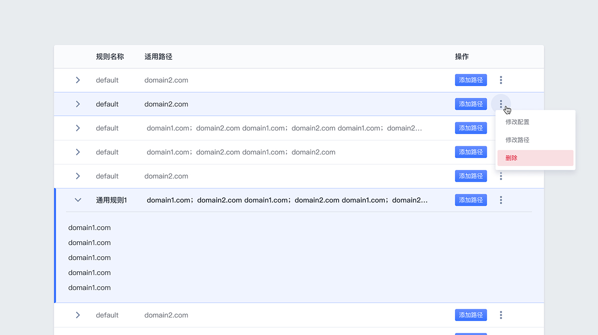
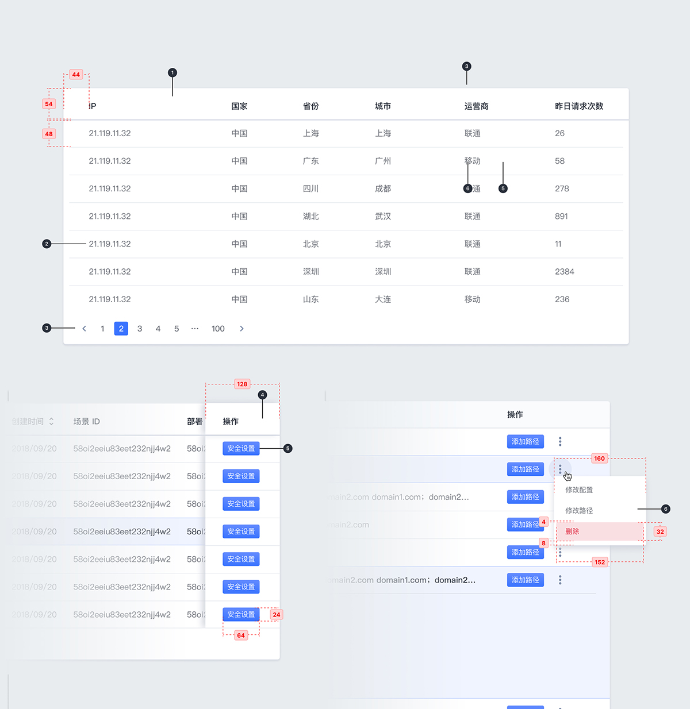

---

用于数据信息的收集与展示，并利于用户浏览和进行信息操作。

## 原则

### 信息为本

信息内容的有效传达室表格的服务本质，表格本身应减少用户的注意力，避免过多的视觉装饰。

### 利于阅读

通过对文本信息的排列、分隔、对齐，让用户更好的获取信息。

### 可操作

用户可以对表格里的信息进行筛选、查找和处理等操作。

## 种类

### 基本数据表格

用于展示基本数据信息的表格。

### 固定信息操作表格

用于展示基本数据信息的表格，并固定操项目。

### 复杂信息操作表格

用于展示和处理复杂的信息表格，有多个操作项。

## 结构

### 本地加载

1. 表头
2. 单元格
3. 分页控件
4. 固定操作浮窗
5. 操作按钮
6. 操作项菜单