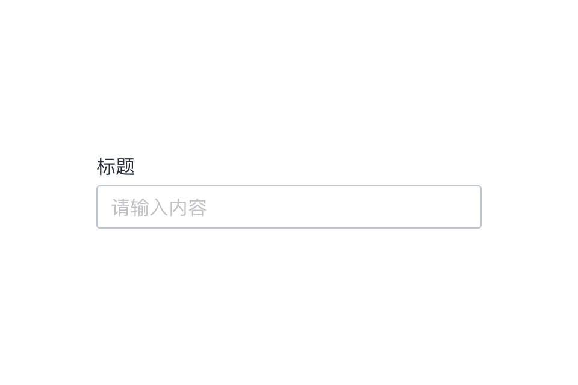

---

文本框允许用户在 UI 中输入文本，它们通常显示在表单和对话框中。

## 原则

### 可发现

文本字段应突出并指示用户可以输入信息。

### 明确

文本字段状态应有清晰地区分。

### 高效

文本字段应易于理解所请求的信息并解决任何错误。

## 种类

### 单行文本框

在单行文本框中，当光标到达字段的右边缘时，比输入框长的文本会自动向左滚动。

### 多行文本域

多行文本框是固定高度，文本自动换行，当光标到达字段底部时垂直滚动。

## 结构

1. 标签文字
2. 前导图标 （可选）
3. 输入文本
4. 尾部图标 （可选）
5. 状态指示
6. 辅助信息 （可选）

## 状态

