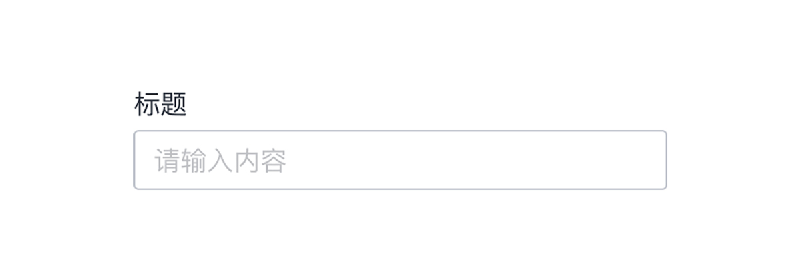
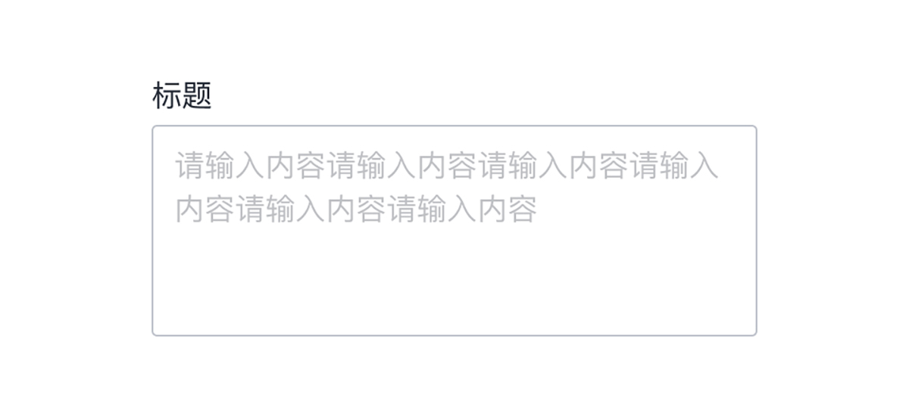
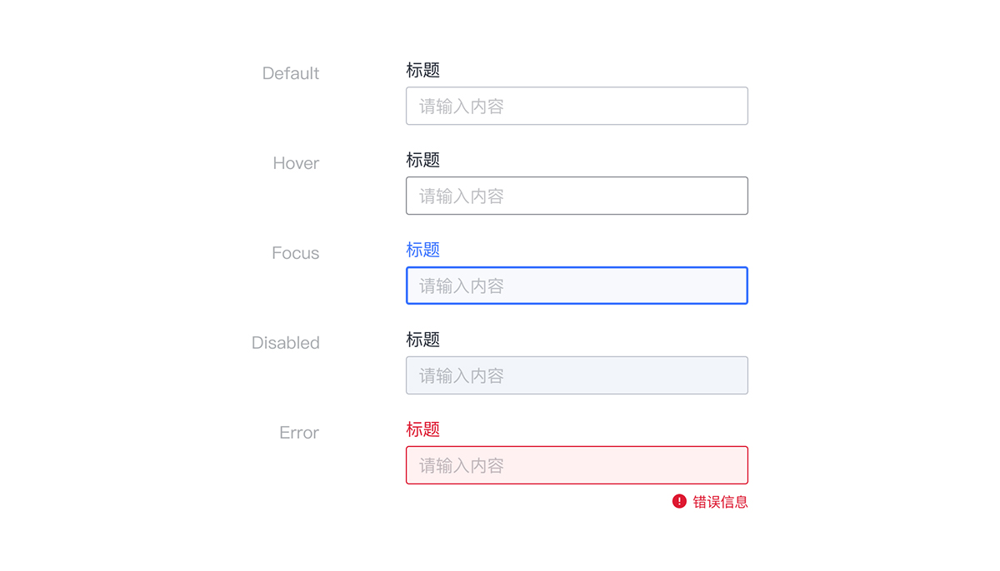

---

## 原则

### 可发现

文本字段应突出并指示用户可以输入信息。

### 明确

文本字段状态应有清晰地区分。

### 高效

文本字段应易于理解所请求的信息并解决任何错误。

## 种类

### 单行文本框

在单行文本框中，当光标到达字段的右边缘时，比输入框长的文本会自动向左滚动。

### 多行文本域

多行文本框是固定高度，文本自动换行，当光标到达字段底部时垂直滚动。

## 结构

1. 标签文字
2. 前导图标 （可选）
3. 输入文本
4. 尾部图标 （可选）
5. 状态指示
6. 辅助信息 （可选）

## 状态

## 颜色

| 色块                                                                | 名称  | 用处               | 色值    |
| :------------------------------------------------------------------ | :---- | :----------------- | :------ |
|  | 灰 07 | 描边               | #C0C4CC |
|  | 蓝 02 | 激活状态指示       | #3973FF |
|  | 灰 01 | 标签文字、内容文本 | #292F3A |
|  | 灰 13 | 按钮悬停态         | #F2F5FA |
|  | 红 01 | 错误信息           | #DD1A32 |

## 文字

| 实例     | 字号（px） | 字重    | 行间距（px） |
| :------- | :--------- | :------ | :----------- |
| 标签文字 | 16         | Regular | 16           |
| 输入文本 | 16         | Regular | 23           |
| 辅助信息 | 14         | Regular | 13           |
