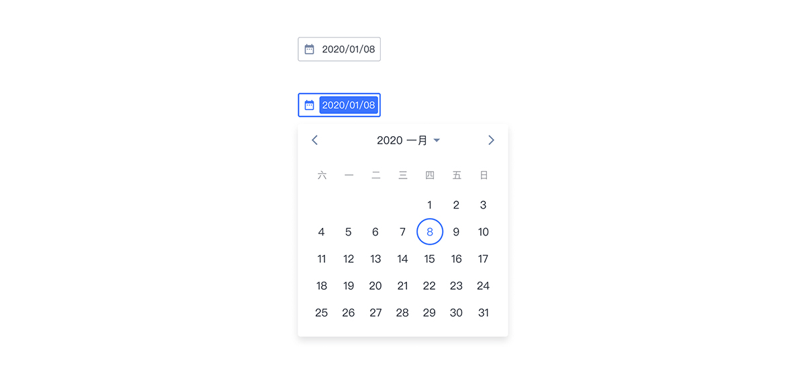
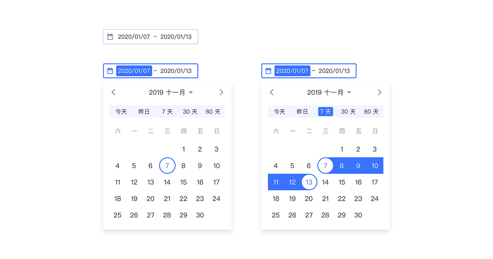
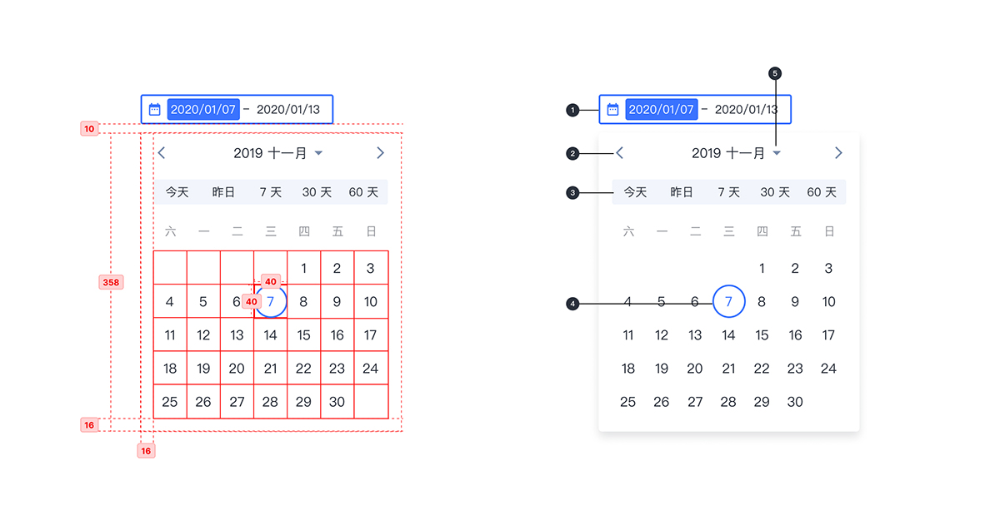
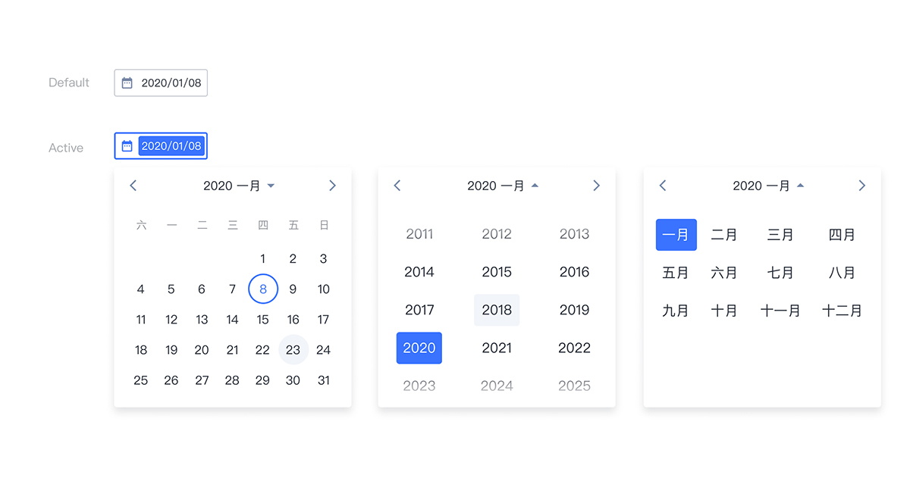

---

日期选择器允许选择（或键入）特定的日期和年份。

## 原则

### 清晰

清楚地指出重要日期，例如当前日期和选定日期。

### 直觉

为确保选择日期的直观，使用常见的选择器模式。

## 种类

### 基础日期选择器

用户可以直接在日历 UI 中选择特定的日期。

### 日期范围选择器

允许选择日期范围，同时显示日历和日期输入字段，结束日期不得小于开始日期。

## 结构

1. 文本框
2. 月份切换
3. 预设日期范围选项栏 （基础日期选择器无此项）
4. 选中日期
5. 年和月的选择

## 状态

