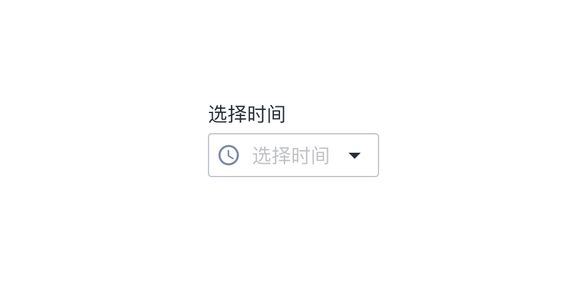
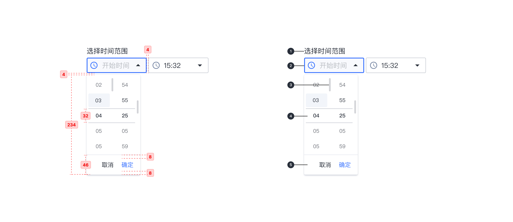

---

时间选择器允许选择（或键入）特定的时间。

## 原则

### 明确

文本字段状态应有清晰地区分。

### 熟悉

时间选择下拉框借鉴 iOS 时间选择器的交互行为。

## 种类

### 基础时间选择器

允许选择（或键入）特定的时间。

### 时间范围选择器

允许选择（或键入）时间范围，结束时间不得小于开始时间。

## 结构

1. 标签文字 （可选）
2. 带有前导图标的下拉框
3. 滚动条 （鼠标移至对应区域显示）
4. 预选择区域
5. 动作栏

## 状态

## 颜色

| 色块                                                                | 名称    | 用处         | 色值    |
| :------------------------------------------------------------------ | :------ | :----------- | :------ |
|  | 蓝 02   | 选中状态指示 | #3973FF |
|  | 灰 01   | 文字         | #292F3A |
|  | 灰 07   | 文本框描边   | #C0C4CC |
|  | 灰 13   | Hover        | #F2F5FA |
|  | 蓝灰 01 | 默认图标填充 | #7888A6 |

## 文字

| 实例       | 字号（px） | 字重    | 行间距 (px) |
| :--------- | :--------- | :------ | :---------- |
| 文本框文字 | 16         | Regular | 16          |
| 时间       | 12         | Regular | 12          |
| 动作栏     | 14         | Regular | 14          |

## 阴影

| 实例 | 名称    | 参数        | 颜色    |
| :--- | :------ | :---------- | :------ |
| 容器 | 阴影 01 | 0px 2px 4px | #CCD0D9 |
