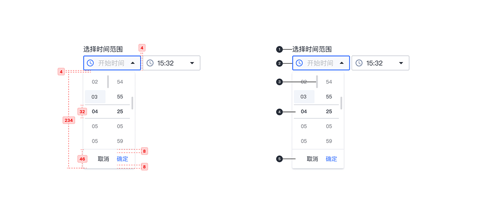
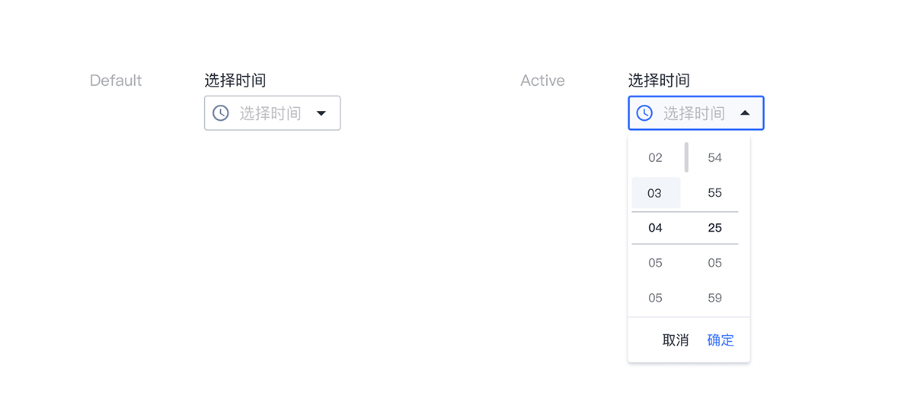

---

时间选择器允许选择（或键入）特定的时间。

## 原则

- 明确

文本字段状态应有清晰地区分。

- 熟悉

时间选择下拉框借鉴 iOS 时间选择器的交互行为。

## 种类

- 基础时间选择器

允许选择（或键入）特定的时间。

- 时间范围选择器

允许选择（或键入）时间范围，结束时间不得小于开始时间。

## 结构 

1. 标签文字 （可选）
2. 带有前导图标的下拉框
3. 滚动条 （鼠标移至对应区域显示）
4. 预选择区域
5. 动作栏

## 状态

