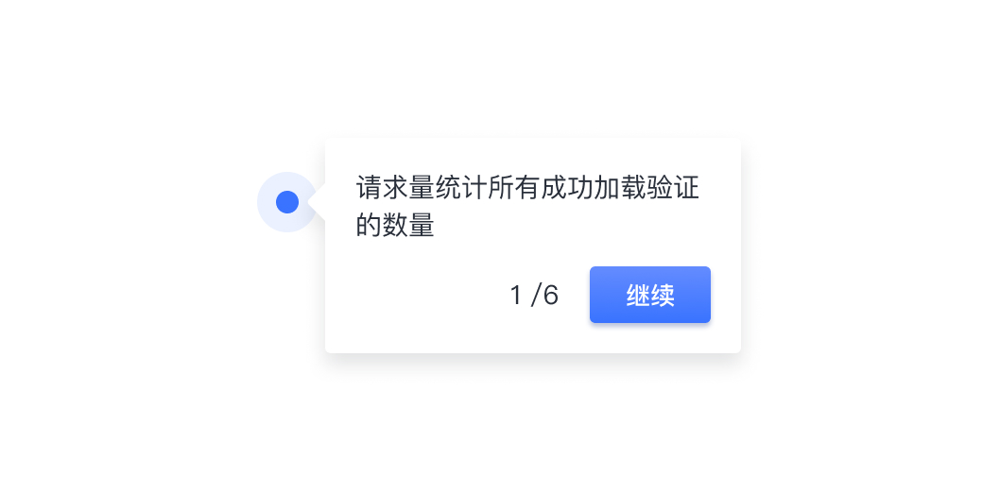
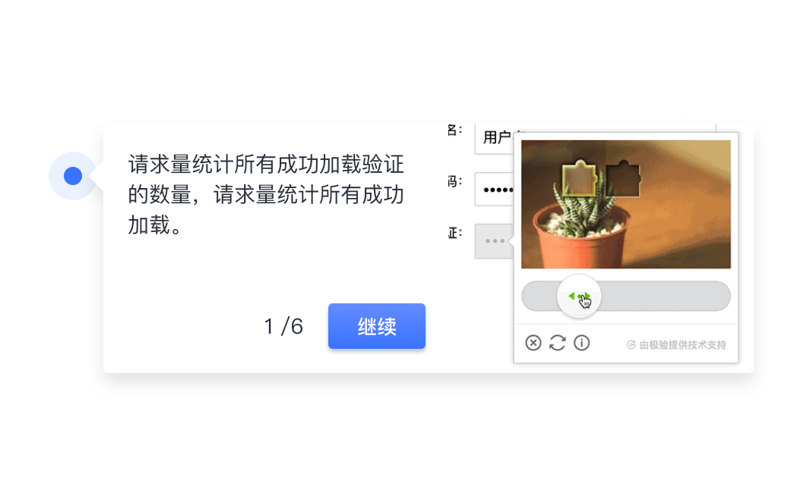
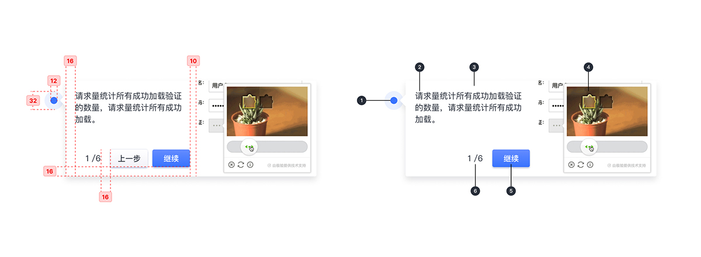
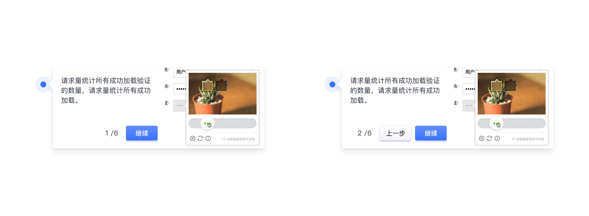

---

## 原则

### 聚焦

将用户注意力转移到特定项目或操作上，一次显示一个提示，且禁止除提示器以外的所有页面交互。

### 友好

显示进度指示器，提示用户所在位置和剩余提示。

### 精简

简短的帮助文本有助于用户快速理解。

## 种类

### 文本步骤指示器

通过文字描述其功能特性。

### 图文步骤指示器

在需要描述复杂功能的情况下，可考虑选用此类型的步骤指示器，配图可以是 Gif 动图。

## 结构

1. 定位点
2. 帮助文本
3. 容器
4. 帮助图片
5. 步骤引导按钮
6. 进度指示

## 状态

## 颜色

| 色块                                                                                                    | 名称    | 用处       | 色值              |
| :------------------------------------------------------------------------------------------------------ | :------ | :--------- | :---------------- |
|  | 渐变 02 | 按钮填充   | #648CFF - #3973FF |
|                                      | 蓝 02   | 定位点     | #3973FF           |
|                                      | 灰色 06 | 定位点外围 | #E6EDFF           |
|                                      | 灰 01   | 文字       | #292F3A           |

## 文字

| 实例     | 字号（px） | 字重    | 行间距（px） |
| :------- | :--------- | :------ | :----------- |
| 标签文字 | 12         | Regular | 12           |
| 标签文字 | 14         | Regular | 14           |

## 阴影

| 实例 | 名称    | 参数        | 颜色    |
| :--- | :------ | :---------- | :------ |
| 容器 | 阴影 01 | 0px 2px 4px | #CCD0D9 |
