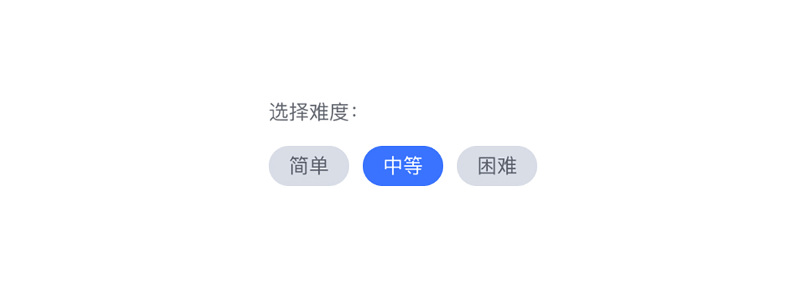
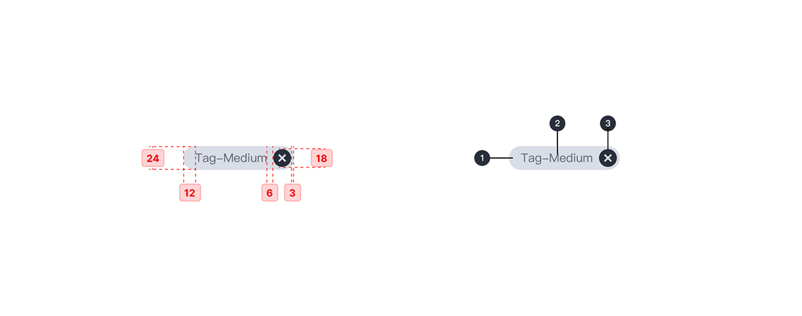
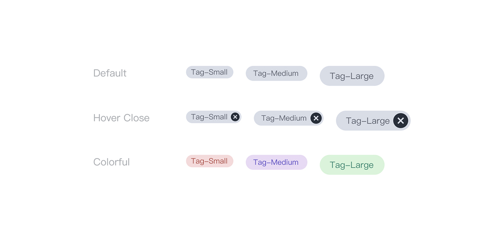

---

## 原则

### 紧凑

结构紧凑，承载较短的文本长度

### 相关性

徽章应与其所代表的内容或任务具有明确且有用的关系。

### 聚焦

使任务更容易完成，或者使内容更容易分类。

## 种类

### 默认药丸徽章

默认的药丸徽章只用做 Tag 类的信息展示，无任何交互，可通过不同颜色达到信息划分。

### 动作药丸徽章

从一组选项中选择单个徽章徽章，在 UI 紧凑区域提供单选操作。

### 药丸徽章过滤器

一般用于筛选操作，激活某徽章时提供删除操作以撤销筛选动作。

## 结构

1. 容器
2. 文字
3. 删除图标 （可选）

## 状态

## 颜色

| 色块                                                                | 名称  | 用处     | 色值    |
| :------------------------------------------------------------------ | :---- | :------- | :------ |
|  | 灰 10 | 容器填充 | #D8DDE6 |
|  | 灰 01 | 文字     | #292F3A |

### 其他颜色的选用

背景色取值范围请只调节 hsl 中的 “h” 值，hsl (h, 50%, 88%, 0.8);
文字颜色的选用需 Contrast Ratio (Chrome 颜色对比度检查器) 检测通过。

## 文字

| 实例     | 字号（px） | 字重    | 行间距（px） |
| :------- | :--------- | :------ | :----------- |
| 标签文字 | 12         | Regular | 12           |
| 标签文字 | 14         | Regular | 14           |
