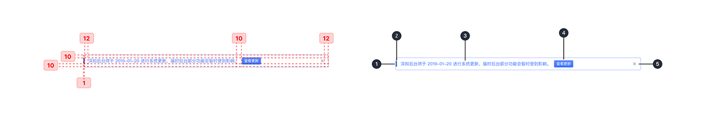
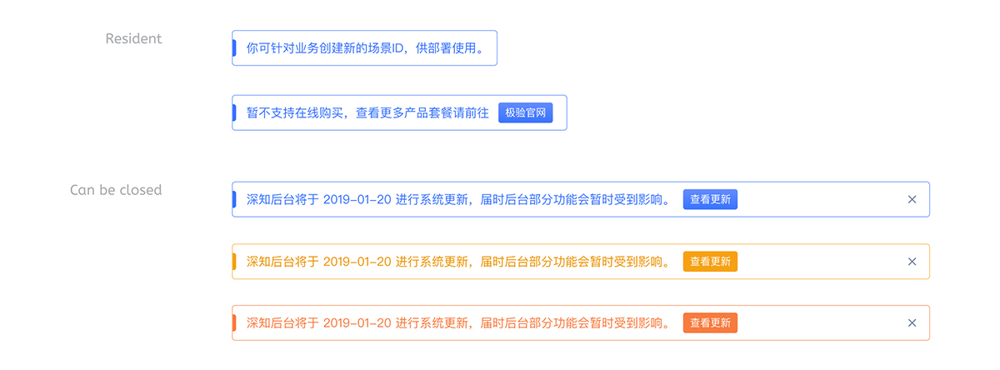

---

显示一条重要、简洁的消息，并为用户提供处理(或取消警报)的操作。它要求用户操作被取消。

## 原则

### 持久

它们具有持久性，允许用户在任何时候忽略它们或与它们交互。

### 数量

一次只能显示一个横幅。

### 清澈

横幅传达简洁的信息，以及如果用户与他们交互会发生什么。

## 种类

### 无链接警报

清晰简洁的句式表达与页面相关的内容，所有内容不超出集装箱的范围，左端顶部带有提示条。

### 有链接警报

文本较长则自动换行，所有内容不超出集装箱的范围，左端顶部带有提示条。右端为用户提供处理的操作。

### 可取消的有链接警报

所有内容不超出集装箱的范围，左端顶部带有提示条。右端为用户提供处理(或取消横幅)的操作，它要求用户操作被取消。

## 结构

1. 集装箱
2. 醒目条
3. 文案动图标
4. 按钮
5. 取消

## 状态

