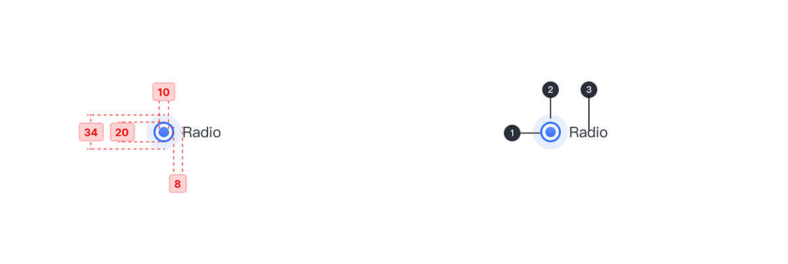
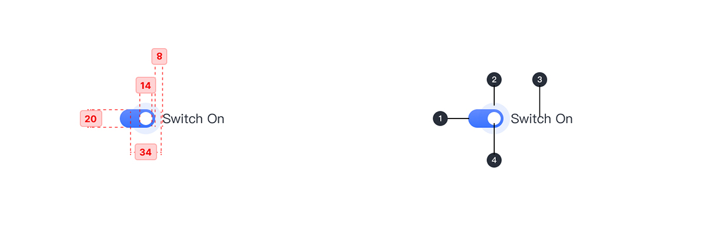

---

## 原则

### 可预期

选择控件常出现在设置或对话框中，应当选用符合预期的选择控件。

### 突出

所选中项应比未选项在视觉上更加突出。

## 种类

### Checkbox 复选框

复选框用于选项列表，用户可以在其中选择多个选项，包括全部或不选择。

### Radio 单选按钮

当两个或多个选项的列表互斥时，将使用单选按钮，这意味着用户只能选择一个选项。

### Switch 切换开关

切换开关可打开或关闭单个设置的状态。它们通常用于立即激活或停用某物。

## 结构

### Checkbox 复选框

1. 复选框
2. Active 状态
3. 标签

### Radio 单选按钮

1. 单选框
2. Active 状态
3. 标签

### Switch 切换开关

1. 轨道
2. Active 状态
3. 标签
4. 拨杆

## 状态

## 颜色

| 色块                                                                                                    | 名称    | 用处                 | 色值              |
| :------------------------------------------------------------------------------------------------------ | :------ | :------------------- | :---------------- |
|  | 渐变 02 | 填充                 | #648CFF - #3973FF |
|                                      | 蓝灰 06 | Active 状态          | #E5EDFF           |
|                                      | 灰 01   | 标签文字             | #292F3A           |
|                                      | 灰 07   | 描边/Switch 按钮拨杆 | #C0C4CC           |
|                                      | 灰 13   | 底色                 | #F2F5FA           |

## 文字

| 实例     | 字号（px） | 字重    | 行间距（px） |
| :------- | :--------- | :------ | :----------- |
| 标签文字 | 14         | Regular | 14           |
