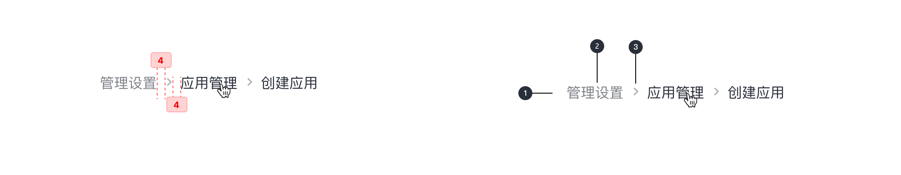

---

二级导航模式，它显示内容之间的层次结构或跟踪用户的路径。

## 原则

### 快速

面包屑使用户能够快速移动到父级或上一步。面包屑中的所有链接都应该是可点击的。

### 层次

等于或大于两层的层次。

### 用法

次要导航，永远不应该完全取代主导航。

## 种类

### 基于位置的面包屑导航

这种类型的面包屑导航可以很好的指出当前页面与整个站点的层次结构。可以使访客了解自己的位置，并更快的找到自己想要到达的页面。提高用户的友好体验。

## 结构

1. 集装箱
2. 不活动文本标签
3. 非活动图标

## 状态

